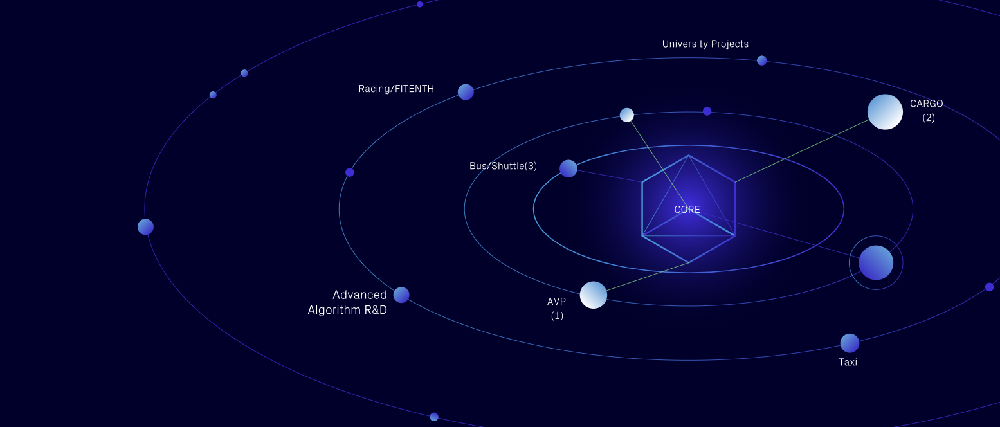

# Autoware Documentation

Welcome to the Autoware Documentation! Here, you'll find comprehensive information about Autoware, the forefront of open-source autonomous driving software.

## About Autoware

Autoware is the world’s leading open-source project dedicated to autonomous driving technology. Built on the Robot Operating System ([ROS 2](https://docs.ros.org/en/foxy/index.html)), Autoware facilitates the commercial deployment of autonomous vehicles across various platforms and applications. Discover more about our innovative project at the [Autoware Foundation website](https://autoware.org/autoware-overview).

## Getting started

### Step into the World of Autoware

**Discover the Concept**: Start your Autoware journey by exploring the [Concept](design/autoware-concepts/index.md) pages. Here, you'll delve into the core ideas behind Autoware, understand its unique features and how it stands out in the field of autonomous driving technology. Learn about the principles guiding its development and the innovative solutions it offers.

### Set Up Your Environment

**Install Autoware**: Once you have a grasp of the Autoware philosophy, it's time to bring it into your world. Visit our [Installation](installation/index.md) section for detailed, step-by-step instructions to seamlessly install Autoware and related tools in your environment. Whether you're a beginner or an expert, these pages are designed to guide you through a smooth setup process.

### Dive Deeper

**Hands-on Experience**: After installation, head over to the [Tutorials](demos/index.md) pages. These tutorials are designed to provide you with hands-on experience with some simulations, allowing you to apply what you've learned and gain practical skills. From basic operations to advanced applications, these tutorials cover a wide range of topics to enhance your understanding of Autoware.

**Advanced Topics**: As you become more familiar with Autoware, the [How-to Guides](how-to-guides/index.md) will be your next destination. These pages delve into more advanced topics, offering deeper insights and more complex scenarios. They're perfect for those looking to expand their knowledge and expertise in specific areas of Autoware. Additionally, this section also covers methods for integrating Autoware with real vehicles, providing practical guidance for those seeking to apply Autoware in real-world settings.

### Understand the Design

**Design Concepts**: For those interested in the architecture and design philosophy of Autoware, the [Design](design/index.md) pages are a treasure trove. Learn about the architectural decisions, design patterns, and the rationale behind the development of Autoware's various components.

### More Information

**Datasets**: The [Datasets](datasets/index.md) pages are a crucial resource for anyone working with Autoware. Here, you'll find a collection of datasets that are compatible with Autoware, providing real-world scenarios and data to test and refine your autonomous driving solutions.

**Support**: As you dive deeper into Autoware, you might encounter challenges or have questions. The [Support](support/index.md) section is designed to assist you in these moments. This area includes FAQs, community forums, and contact information for getting help with Autoware. It's also a great place to connect with other Autoware users and contributors, sharing experiences and solutions.

**Competitions**: The [Competitions](autoware-competitions/index.md) pages are where excitement meets innovation. Autoware regularly hosts or participates in various competitions and challenges, providing a platform for users to test their skills, showcase their work, and contribute to the community. These competitions range from local to global scale, offering opportunities for both beginners and experts to engage and excel. Stay updated with upcoming events and take part in the advancement of autonomous driving technologies.

### Contribute and Collaborate

**Become a Part of the Autoware Story**: Your journey with Autoware isn't just about learning and using; it's also about contributing and shaping the future of autonomous driving. The [Contributing](contributing/index.md) section is more than just a guide; it's an invitation to be part of something bigger. Whether you're a coder, a writer, or an enthusiast, your contributions can propel Autoware forward. Join us, and let's build the future together.

## Related Documentations

In addition to this page, there are several related documentations to further your knowledge and understanding of Autoware:

- [Autoware Core Documentation](https://autowarefoundation.github.io/autoware_core/main/)
- [Autoware Universe Documentation](https://autowarefoundation.github.io/autoware_universe/) contains technical documentations of each component/function such as localization, planning, etc.
- [Autoware Tools Documentation](https://autowarefoundation.github.io/autoware_tools/main/) contains technical documentations of each tools for autonomous driving such as performance analysis, calibration, etc.
