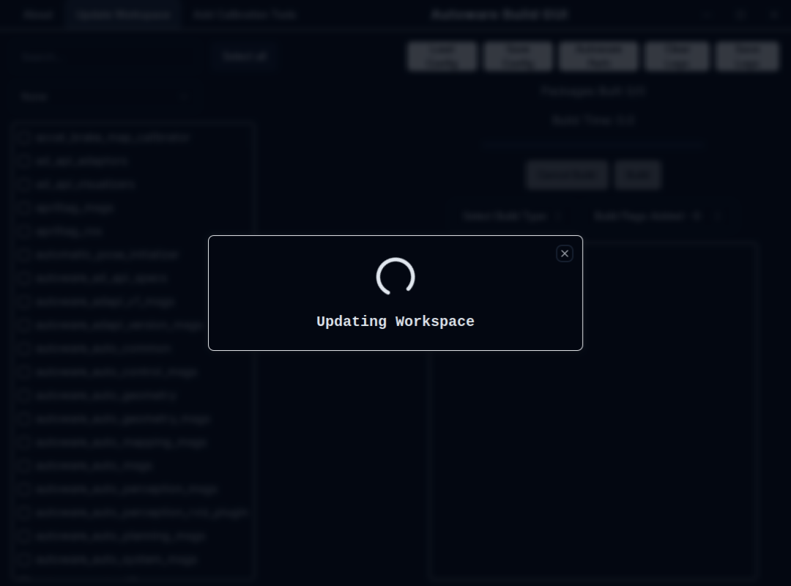

# Source installation

## Prerequisites

- OS
  - [Ubuntu 22.04](https://releases.ubuntu.com/22.04/)

- ROS
  - ROS 2 Humble

  For ROS 2 system dependencies, refer to [REP-2000](https://www.ros.org/reps/rep-2000.html).

- [Git](https://git-scm.com/)
  - [Registering SSH keys to GitHub](https://github.com/settings/keys) is preferable.

```bash
sudo apt-get -y update
sudo apt-get -y install git
```

> Note: If you wish to use ROS 2 Galactic on Ubuntu 20.04, refer to installation instruction from [galactic](https://autowarefoundation.github.io/autoware-documentation/galactic/installation/autoware/source-installation/) branch, but be aware that Galactic version of Autoware might not have the latest features.

## How to set up a development environment

1. Clone `autowarefoundation/autoware` and move to the directory.

   ```bash
   git clone https://github.com/autowarefoundation/autoware.git
   cd autoware
   ```

2. If you are installing Autoware for the first time, you can automatically install the dependencies by using the provided Ansible script.

   ```bash
   ./setup-dev-env.sh
   ```

   If you encounter any build issues, please consult the [Troubleshooting](../../support/troubleshooting/index.md#build-issues) section for assistance.

!!! info

    Before installing NVIDIA libraries, please ensure that you have reviewed and agreed to the licenses.

    - [CUDA](https://docs.nvidia.com/cuda/eula/index.html)
    - [cuDNN](https://docs.nvidia.com/deeplearning/cudnn/sla/index.html)
    - [TensorRT](https://docs.nvidia.com/deeplearning/tensorrt/sla/index.html)

!!! note

    The following items will be automatically installed. If the ansible script doesn't work or if you already have different versions of dependent libraries installed, please install the following items manually.

    - [Install Ansible](https://github.com/autowarefoundation/autoware/tree/main/ansible#ansible-installation)
    - [Install Build Tools](https://github.com/autowarefoundation/autoware/tree/main/ansible/roles/build_tools#manual-installation)
    - [Install Dev Tools](https://github.com/autowarefoundation/autoware/tree/main/ansible/roles/dev_tools#manual-installation)
    - [Install gdown](https://github.com/autowarefoundation/autoware/tree/main/ansible/roles/gdown#manual-installation)
    - [Install geographiclib](https://github.com/autowarefoundation/autoware/tree/main/ansible/roles/geographiclib#manual-installation)
    - [Install the RMW Implementation](https://github.com/autowarefoundation/autoware/tree/main/ansible/roles/rmw_implementation#manual-installation)
    - [Install ROS 2](https://github.com/autowarefoundation/autoware/tree/main/ansible/roles/ros2#manual-installation)
    - [Install ROS 2 Dev Tools](https://github.com/autowarefoundation/autoware/tree/main/ansible/roles/ros2_dev_tools#manual-installation)
    - [Install Nvidia CUDA](https://github.com/autowarefoundation/autoware/tree/main/ansible/roles/cuda#manual-installation)
    - [Install Nvidia cuDNN and TensorRT](https://github.com/autowarefoundation/autoware/tree/main/ansible/roles/tensorrt#manual-installation)
    - [Install the Autoware RViz Theme](https://github.com/autowarefoundation/autoware/tree/main/ansible/roles/qt5ct_setup#readme) (only affects Autoware RViz)
    - [Download the Artifacts](https://github.com/autowarefoundation/autoware/tree/main/ansible/roles/artifacts#readme) (for perception inference)

## How to set up a workspace

!!! info "[Using Autoware Build GUI](#using-autoware-build-gui)"

    If you prefer a graphical user interface (GUI) over the command line for launching and managing your simulations, refer to the `Using Autoware Build GUI` section at the end of this document for a step-by-step guide.

1. Create the `src` directory and clone repositories into it.

   Autoware uses [vcstool](https://github.com/dirk-thomas/vcstool) to construct workspaces.

   ```bash
   cd autoware
   mkdir src
   vcs import src < autoware.repos
   ```

   If you are an active developer, you may also want to pull the nightly repositories, which contain the latest updates:

   ```bash
   vcs import src < autoware-nightly.repos
   ```

   > ⚠️ Note: The nightly repositories are unstable and may contain bugs. Use them with caution.

   Optionally, you may also download the extra repositories that contain drivers for specific hardware, but they are not necessary for building and running Autoware:

   ```bash
   vcs import src < extra-packages.repos
   ```

   > ⚠️ You might need to install the dependencies of the extra packages manually.
   >
   > ➡️ Check the readme of the extra packages for more information.

2. Install dependent ROS packages.

   Autoware requires some ROS 2 packages in addition to the core components.
   The tool `rosdep` allows an automatic search and installation of such dependencies.
   You might need to run `rosdep update` before `rosdep install`.

   ```bash
   source /opt/ros/humble/setup.bash
   # Make sure all previously installed ros-$ROS_DISTRO-* packages are upgraded to their latest version
   sudo apt update && sudo apt upgrade
   rosdep update
   rosdep install -y --from-paths src --ignore-src --rosdistro $ROS_DISTRO
   ```

3. [Install and set up ccache to speed up consecutive builds](../../tutorials/others/advanced-usage-of-colcon.md#using-ccache-to-speed-up-recompilation). _(optional but highly recommended)_

4. Build the workspace.

   Autoware uses [colcon](https://github.com/colcon) to build workspaces.
   For more advanced options, refer to the [documentation](https://colcon.readthedocs.io/).

   ```bash
   colcon build --symlink-install --cmake-args -DCMAKE_BUILD_TYPE=Release
   ```

   If there is any build issue, refer to [Troubleshooting](../../support/troubleshooting/index.md#build-issues).

5. Follow the steps in [Network Configuration](../../installation/additional-settings-for-developers/network-configuration/index.md) before running Autoware.

6. Apply the settings recommended in [Console settings for ROS 2](../../installation/additional-settings-for-developers/console-settings.md) for a better development experience. _(optional)_

## How to update a workspace

1. Update the `.repos` file.

   ```bash
   cd autoware
   git pull <remote> <your branch>
   ```

   `<remote>` is usually `git@github.com:autowarefoundation/autoware.git`

2. Update the repositories.

   ```bash
   vcs import src < autoware.repos
   ```

   > ⚠️ If you are using nightly repositories, you can also update them.
   >
   > ```bash
   > vcs import src < autoware-nightly.repos
   > ```

   ```bash
   vcs pull src
   ```

   For Git users:
   - `vcs import` is similar to `git checkout`.
     - Note that it doesn't pull from the remote.
   - `vcs pull` is similar to `git pull`.
     - Note that it doesn't switch branches.

   For more information, refer to the [official documentation](https://github.com/dirk-thomas/vcstool).

   It might be the case that dependencies imported via `vcs import` have been moved/removed.
   VCStool does not currently handle those cases, so if builds fail after `vcs import`, cleaning
   and re-importing all dependencies may be necessary:

   ```bash
   rm -rf src/*
   vcs import src < autoware.repos
   ```

   > ⚠️ If you are using nightly repositories, import them as well.
   >
   > ```bash
   > vcs import src < autoware-nightly.repos
   > ```

3. Install dependent ROS packages.

   ```bash
   source /opt/ros/humble/setup.bash
   # Make sure all previously installed ros-$ROS_DISTRO-* packages are upgraded to their latest version
   sudo apt update && sudo apt upgrade
   rosdep update
   rosdep install -y --from-paths src --ignore-src --rosdistro $ROS_DISTRO
   ```

4. Build the workspace.

   ```bash
   colcon build --symlink-install --cmake-args -DCMAKE_BUILD_TYPE=Release
   ```

## Using Autoware Build GUI

In addition to the traditional command-line methods of building Autoware packages, developers and users can leverage the Autoware Build GUI for a more streamlined and user-friendly experience. This GUI application simplifies the process of building and managing Autoware packages.

### Integration with Autoware source installation

When using the Autoware Build GUI in conjunction with the traditional source installation process:

- **Initial Setup**: Follow the standard Autoware source installation guide to set up your environment and workspace.
- **Using the GUI**: Once the initial setup is complete, you can use the Autoware Build GUI to manage subsequent builds and package updates.

This integration offers a more accessible approach to building and managing Autoware packages, catering to both new users and experienced developers.

### Getting started with Autoware Build GUI

1. **Installation:** Ensure you have installed the Autoware Build GUI. [Installation instructions](https://github.com/autowarefoundation/autoware-build-gui#installation).
2. **Launching the App**: Once installed, launch the Autoware Build GUI.
   
3. **Setting Up**: Set the path to your Autoware folder within the GUI.
   
4. **Building Packages**: Select the Autoware packages you wish to build and manage the build process through the GUI.
   

   4.1. **Build Configuration**: Choose from a list of default build configurations, or select the packages you wish to build manually.
   

   4.2. **Build Options**: Choose which build type you wish to use, with ability to specify additional build options.
   

5. **Save and Load**: Save your build configurations for future use, or load a previously saved configuration if you don't wish to build all packages or use one of the default configurations provided.
   
6. **Updating Workspace**: Update your Autoware workspace's packages to the latest version using the GUI or adding Calibration tools to the workspace.
   
