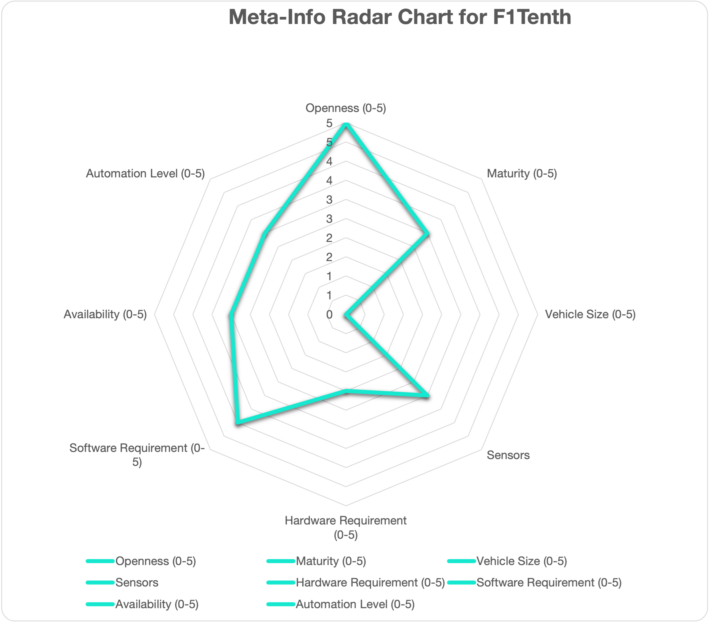
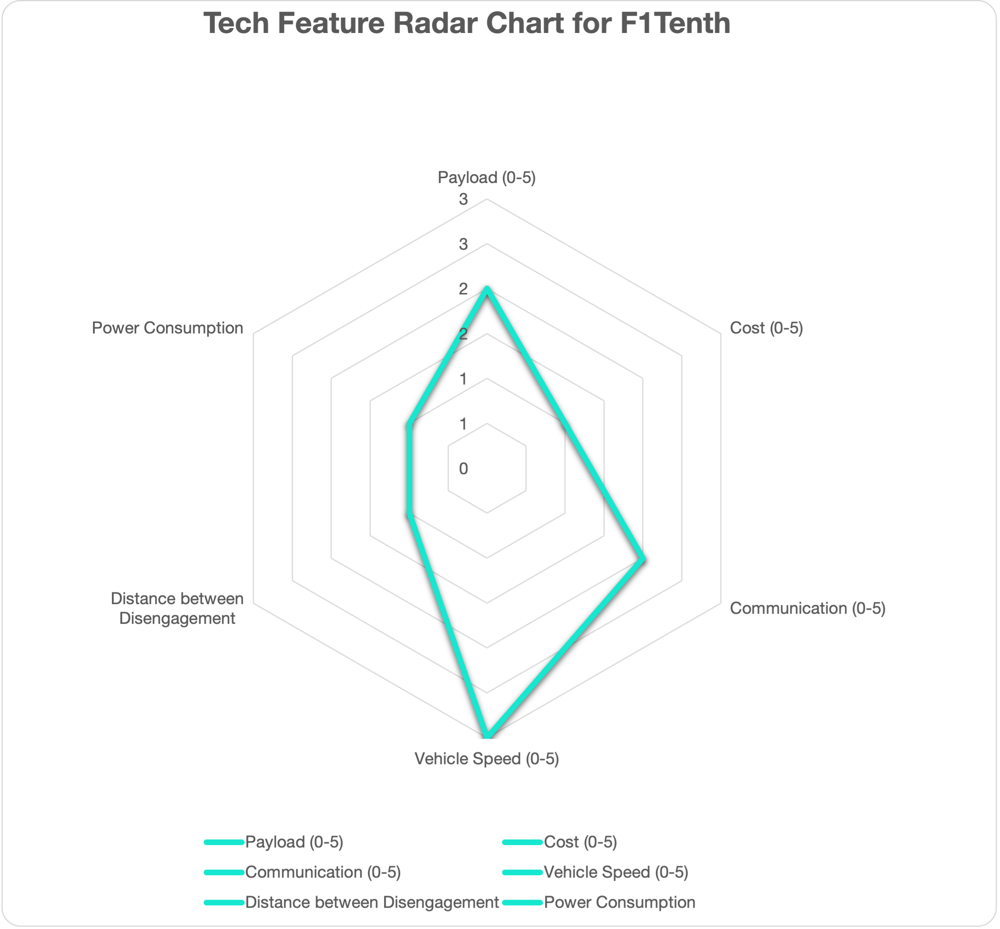

# Overview

This document elaborates the hardware and software configurations for using Autoware for autonomous driving. Hence, it will serve as a guideline to select hardware and software components to build autonomous vehicles. However, this document is NOT prepared as neither step-by-step instructions nor Q&A books, which will be provided as a reference link if available.

# Design Overview

# Who should read

One is interested in building your autonomous racing cars or low-cost platforms to learn Autoware, and looks for the place to start with.

# References and Resources

- Complete F1Tenth documents: [link](https://f1tenth.readthedocs.io/en/foxy_test/getting_started/intro.html)
- Step-By-Step Instructions to deploy Autoware on F1Tenth: [link](https://f1tenth.readthedocs.io/en/foxy_test/autoware/intro.html)

# Contributors: [complete list](https://f1tenth.readthedocs.io/en/foxy_test/support/acknowledgment.html#contributors)

## F1TENTH Core Developers

- Hongrui (Billy) Zheng
- Johannes Betz

## Contributors

- Matthew O’Kelly
- Kim Luong
- Haoru Xue
- Joshua Whitley
- F1TENTH Lehigh and Rosa Zheng
- F1TENTH UCSD and Jack Silberman
- Jim Benson

# Community Outreach

- Rahul Mangharam
- F1TENTH Clemson and Venkat Krovi
- Jaroslav Klapálek

# Targeted Use Cases

| Use Cases: |             Education             |              Racing               |                 PoC                 |             Open AD Kit             |   Commercial Services/Production    |
| :--------: | :-------------------------------: | :-------------------------------: | :---------------------------------: | :---------------------------------: | :---------------------------------: |
|  F1Tenth   | <input type="checkbox" checked /> | <input type="checkbox" checked /> | <input type="checkbox" disabled  /> | <input type="checkbox" disabled  /> | <input type="checkbox" disabled  /> |

# ODD

|   ODD   |                Cargo                |                Bus                 |              RoboTaxi               |     Low Speed (Utility) Vehicle     |           Delivery Robot            |
| :-----: | :---------------------------------: | :--------------------------------: | :---------------------------------: | :---------------------------------: | :---------------------------------: |
| F1Tenth | <input type="checkbox" disabled  /> | <input type="checkbox" disabled /> | <input type="checkbox" disabled  /> | <input type="checkbox" disabled  /> | <input type="checkbox" disabled  /> |

# Automation Level

| Automation Level |                 0                  |                 1                  |                 2                 |                  3                  |                  4                  |                  5                  |
| :--------------: | :--------------------------------: | :--------------------------------: | :-------------------------------: | :---------------------------------: | :---------------------------------: | :---------------------------------: |
|     F1Tenth      | <input type="checkbox" checked  /> | <input type="checkbox" checked  /> | <input type="checkbox" checked /> | <input type="checkbox" disabled  /> | <input type="checkbox" disabled  /> | <input type="checkbox" disabled  /> |

# System Architecture

F1Tenth can be used for racing and education purpose. The simplest use case is to avoid colliding into the obstacle on a racing track. Meanwhile, one can also develop the SLAM algorithm to build the map on the fly and finishes the loop in short time.

![[f1tenth_NX.webp]]

# Hardware Configuration

## Chassis

- Traxxas Slash 4x4 Premium: [link to purchase](https://www.amainhobbies.com/traxxas-slash-4x4-ultimate-rtr-4wd-short-course-truck-orange-tra68077-4-orng/p858530)
- VESC Speed Controllers: # VESC 6 MK III

## Sensors

- Lidar: choose one
  - Hokuyo UTM-30LX
  - Hokuyo 10LX
- Camera (optional):
  - ZED 2
  - Intel Real Sense

## Computing Platforms

- NVIDIA Jetson Xavier NX
- USB Hub (4 ports)
- (DEPRECATED) NVIDIA Jetson TX2

![[together_NX_00.jpeg]]

# Software Configuration

- Software on the car:
  - Operating System: Linux 20.04
  - ROS: [ROS2 galactic](https://docs.ros.org/en/galactic/Installation/Ubuntu-Install-Debians.html)
  - GPU Driver: nVidia: JetPack 5.1.1 (rev. 1)
  - [Autoware](https://github.com/autowarefoundation/autoware.git)
  - SLAM Toolbox to create and edit map: ros-galactic-slam-toolbox
- Tools:
  - Simulator: [f1tenth simulator](https://f1tenth.readthedocs.io/en/foxy_test/going_forward/simulator/index.html)
  - VESC Tool for motor control: [link](https://vesc-project.com/vesc_tool)
  - Version Control tool: [vcstool](https://github.com/dirk-thomas/vcstool)
