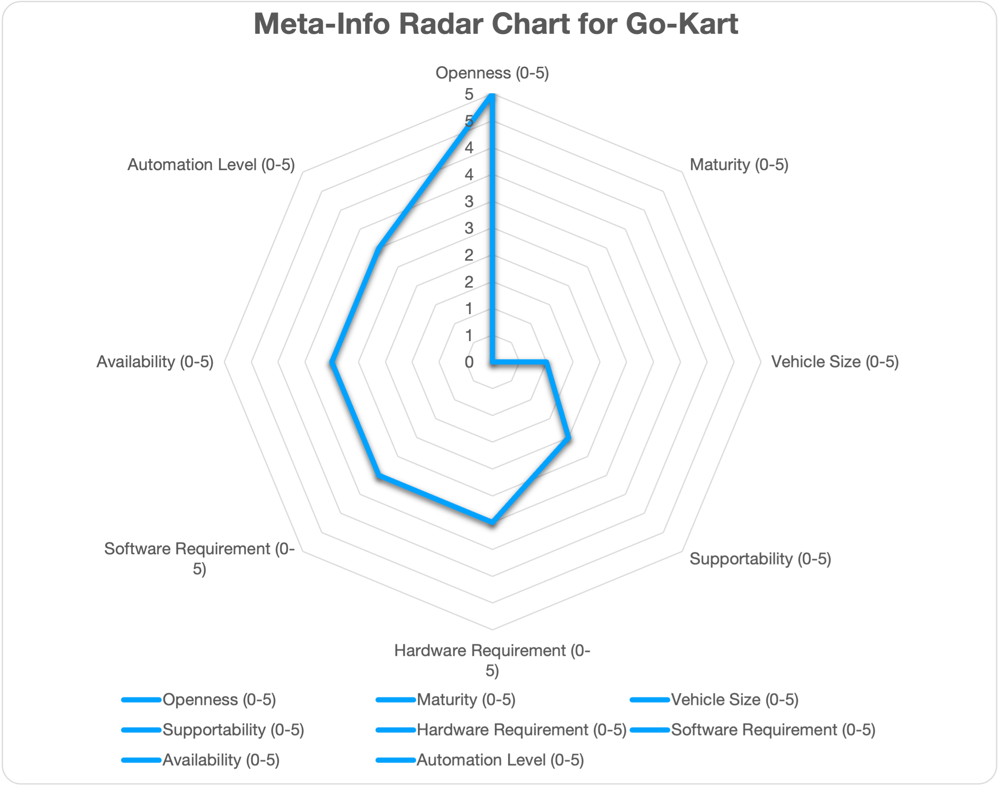
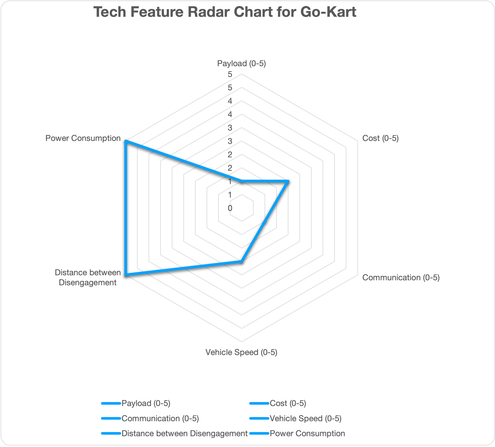
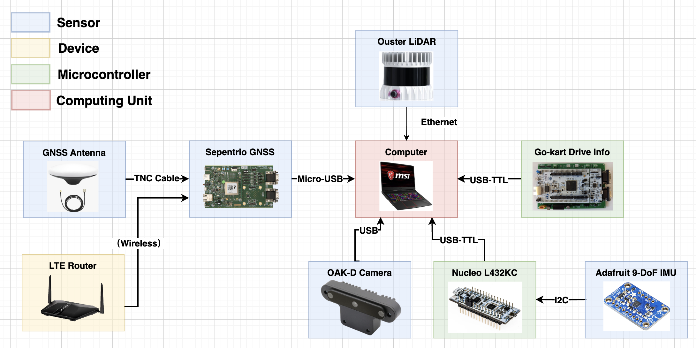

# Reference Design for Go-Kart

## Overview

This document elaborates the hardware and software configurations for using Autoware for autonomous driving. Hence, it will serve as a guideline to select hardware and software components to build autonomous vehicles. However, this document is NOT prepared as neither step-by-step instructions nor Q&A books, which will be provided as a reference link if available.

## Design Overview

!!! note

    - Maturity: Currently the go-kart has only been tested by us in closed regions. HUMDA is replicating our vehicle and will be testing in closed regions once they finish building (maturity will become 1).
    - Hardware Requirement: The current design uses a laptop for computing though we are considering the options of switching to a Jetson Orin Nano or an OpenAD Kit enabled platform.
    - Software Requirement: No containerization is required.

!!! note

    - Distance between Disengagement: We have not specifically tested the distance between disengagement. In a closed track it may go indefinitely until the battery runs out.
    - Power Consumption: Typical power consumption in our test is less than 1000W though the vehicle can technically go much faster and draw more power. The best we have achieved was having no disengagement for 5 laps at the Purdue Grand Prix Track ( > 2km total distance) at the competition. We stopped the vehicle because it reached the lap limit though it could go farther if not stopped.

## Who should read

One is interested in building your small size autonomous vehicles and looks for the place to start with.

## References and Resources

- Complete Go-Kart with Autoware documents: [link](https://go-kart-upenn.readthedocs.io/en/latest/)
- ROS 2 Foxy setup and autonomous code: [link](https://github.com/mlab-upenn/gokart-sensor/tree/ros2_foxy_purepursuit)

- ROS 2 Humble setup and autonomous code: [Link](https://github.com/mlab-upenn/gokart-sensor/tree/ros2_humble_purepursuit)

- STM32 nucleo controller code: [link](https://github.com/mlab-upenn/gokart-mechatronics/tree/main/STM32%20Control)

## Contributors

- Autoware Center of Excellence (under Prof. Rahul Mangharam)

## Targeted Use Cases

| Use Cases: |             Education             |              Racing               |                PoC                 |             Open AD Kit             |   Commercial Services/Production    |
| :--------: | :-------------------------------: | :-------------------------------: | :--------------------------------: | :---------------------------------: | :---------------------------------: |
|  F1Tenth   | <input type="checkbox" checked /> | <input type="checkbox" checked /> | <input type="checkbox" checked  /> | <input type="checkbox" disabled  /> | <input type="checkbox" disabled  /> |

## ODD

|   ODD   |                Cargo                |                Bus                 |              RoboTaxi               |     Low Speed (Utility) Vehicle     |           Delivery Robot            |
| :-----: | :---------------------------------: | :--------------------------------: | :---------------------------------: | :---------------------------------: | :---------------------------------: |
| F1Tenth | <input type="checkbox" disabled  /> | <input type="checkbox" disabled /> | <input type="checkbox" disabled  /> | <input type="checkbox" disabled  /> | <input type="checkbox" disabled  /> |

## Automation Level

| Automation Level |                 0                  |                 1                  |                 2                 |                 3                  |                  4                  |                  5                  |
| :--------------: | :--------------------------------: | :--------------------------------: | :-------------------------------: | :--------------------------------: | :---------------------------------: | :---------------------------------: |
|     F1Tenth      | <input type="checkbox" checked  /> | <input type="checkbox" checked  /> | <input type="checkbox" checked /> | <input type="checkbox" checked  /> | <input type="checkbox" disabled  /> | <input type="checkbox" disabled  /> |

## System Architecture

Autonomous Go-Kart is a one-third scale autonomous go-kart autonomous vehicle for development and prototyping purpose. It can be used for developing and testing software components in Autoware.

## Hardware Configuration

### Chassis

- TopKart

### Sensors

- Lidar: Ouster LIDAR OS1 and Velodyne M1600
- Camera: OAK-D camera
- GNSS: RTK-GNSS

### Computing Platforms

- X86 laptop with nVidia GPU

## Software Configuration

The Go-Kart project has significant planning and other high level navigation components which require understanding of the compute system and how it’s setup. The required software includes the following:

- SolidWorks
- VSCode or editor of your choice
- STM32CubeIDE
- VESC tool
- Altium Designer
- 3D printer software like MakerBot

The complete software configuration can be found at [this page](https://go-kart-upenn.readthedocs.io/en/latest/Build-the-Kart/Software/index.html)
