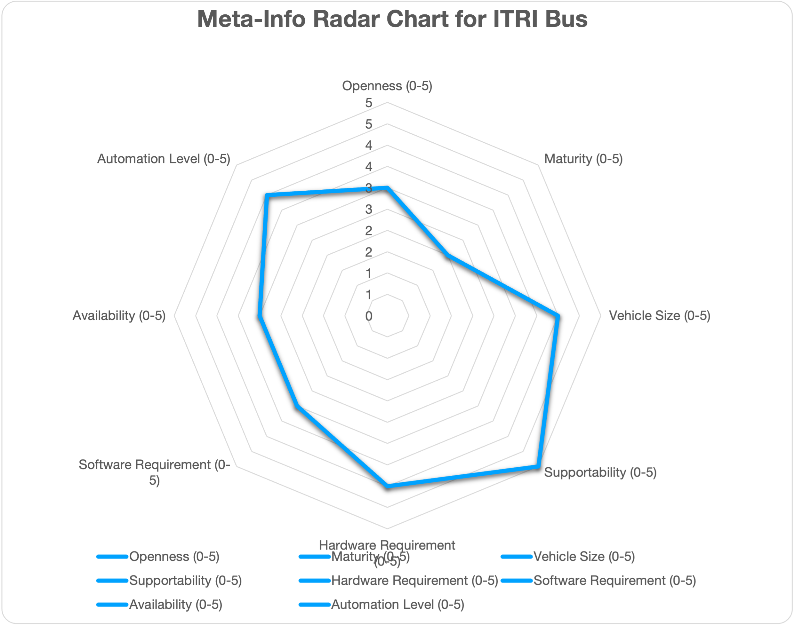
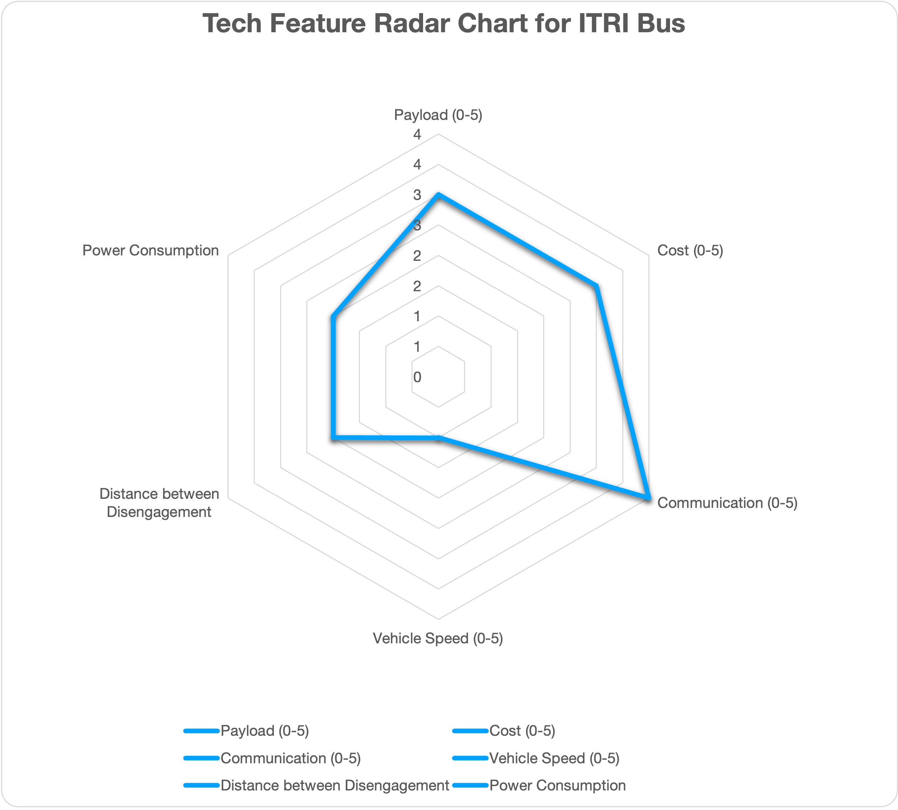

# ITRI Bus reference design

## Overview

This document elaborates the hardware and software configurations for using Autoware for autonomous driving. Hence, it will serve as a guideline to select hardware and software components to build autonomous vehicles. However, this document is NOT prepared as neither step-by-step instructions nor Q&A books, which will be provided as a reference link if available.

## Design overview

## Who should read

One is interested in building your autonomous bus, and looks for the place to start with.

## References and resources

- (To-be-added)

## Contributors

- (To-be-added)

## Targeted use cases

| Use Cases: |             Education             |              Racing               |                 PoC                 |             Open AD Kit             |   Commercial Services/Production    |
| :--------: | :-------------------------------: | :-------------------------------: | :---------------------------------: | :---------------------------------: | :---------------------------------: |
|  ITRI Bus  | <input type="checkbox" checked /> | <input type="checkbox" checked /> | <input type="checkbox" disabled  /> | <input type="checkbox" disabled  /> | <input type="checkbox" disabled  /> |

## ODD

|   ODD    |                Cargo                |                Bus                 |              RoboTaxi               |     Low Speed (Utility) Vehicle     |           Delivery Robot            |
| :------: | :---------------------------------: | :--------------------------------: | :---------------------------------: | :---------------------------------: | :---------------------------------: |
| ITRI Bus | <input type="checkbox" disabled  /> | <input type="checkbox" disabled /> | <input type="checkbox" disabled  /> | <input type="checkbox" disabled  /> | <input type="checkbox" disabled  /> |

## Automation level

| Automation Level |                 0                  |                 1                  |                 2                 |                  3                  |                  4                  |                  5                  |
| :--------------: | :--------------------------------: | :--------------------------------: | :-------------------------------: | :---------------------------------: | :---------------------------------: | :---------------------------------: |
|     ITRI Bus     | <input type="checkbox" checked  /> | <input type="checkbox" checked  /> | <input type="checkbox" checked /> | <input type="checkbox" disabled  /> | <input type="checkbox" disabled  /> | <input type="checkbox" disabled  /> |

## System architecture

(To-be-Added)

## Hardware configuration

### Chassis

- (To-be-added)

### Sensors

- (To-be-added)

### Computing platforms

## Software configuration
