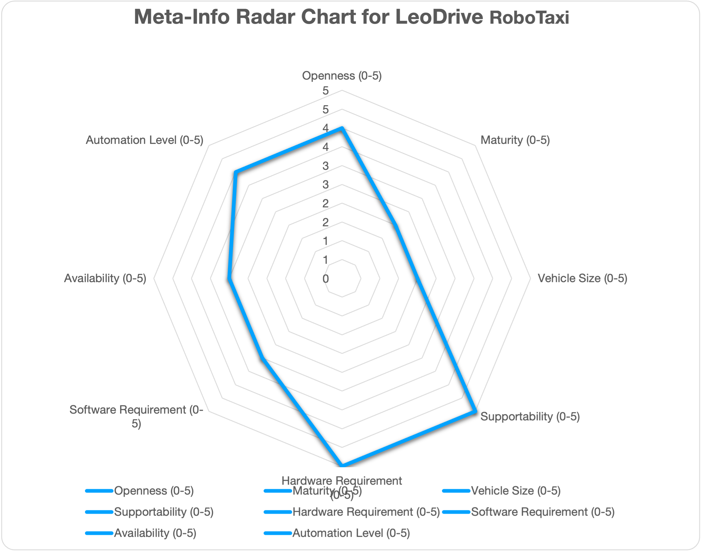
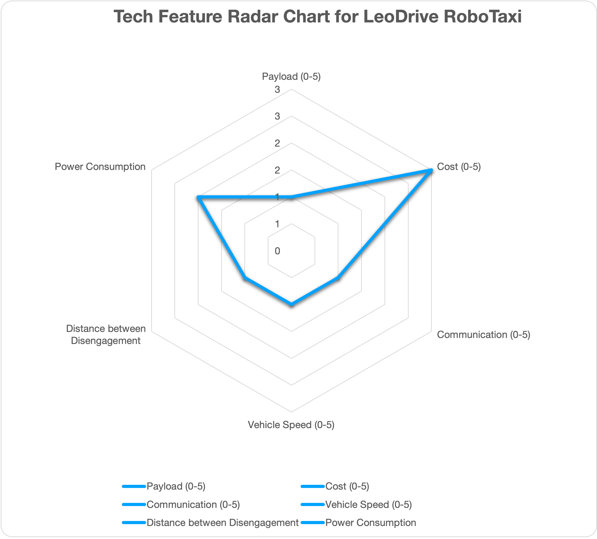
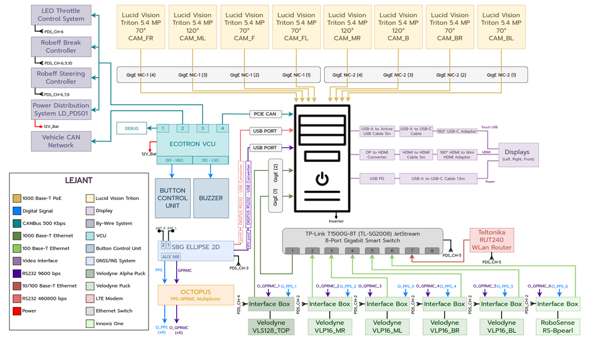
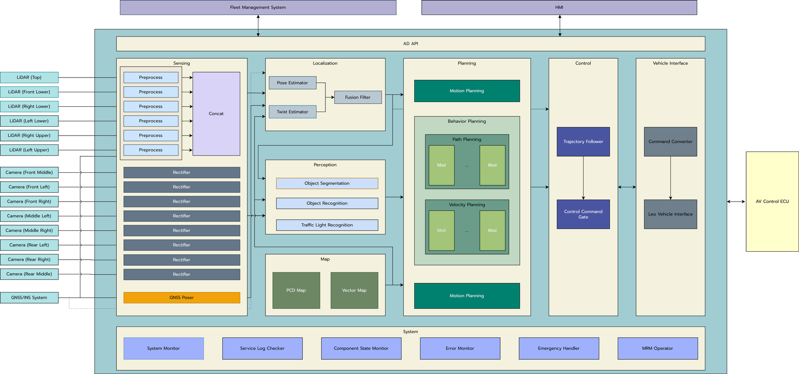

# Reference Design for LeoTaxi

## Overview

This document elaborates the hardware and software configurations for using Autoware for autonomous driving. Hence, it will serve as a guideline to select hardware and software components to build autonomous vehicles. However, this document is NOT prepared as neither step-by-step instructions nor Q&A books, which will be provided as a reference link if available.

## Design Overview

## Who should read

One is interested in building autonomous cars for taxi service and looking for a place to start with.

## References and Resources

- Complete LeoDrive RoboTaxi design documents: [link](https://leodrive.atlassian.net/wiki/spaces/MD/pages/97583105/Overview+of+Reference+Design)
- Feature list of LeoDrive RoboTaxi: [link](https://leodrive.atlassian.net/wiki/spaces/MD/pages/104071185/Autonomous+Driving+Feature+List)

## Contributors

### Core Developers

### Contributors

## Community Outreach

## Targeted Use Cases

|    Use Cases:     |             Education             |              Racing               |                 PoC                 |             Open AD Kit             |  Commercial Services/Production   |
| :---------------: | :-------------------------------: | :-------------------------------: | :---------------------------------: | :---------------------------------: | :-------------------------------: |
| LeoDrive RoboTaxi | <input type="checkbox" checked /> | <input type="checkbox" checked /> | <input type="checkbox" disabled  /> | <input type="checkbox" disabled  /> | <input type="checkbox" checked /> |

## ODD

|        ODD        |                Cargo                |                Bus                 |             RoboTaxi              |     Low Speed (Utility) Vehicle     |           Delivery Robot            |
| :---------------: | :---------------------------------: | :--------------------------------: | :-------------------------------: | :---------------------------------: | :---------------------------------: |
| LeoDrive RoboTaxi | <input type="checkbox" disabled  /> | <input type="checkbox" disabled /> | <input type="checkbox" checked /> | <input type="checkbox" disabled  /> | <input type="checkbox" disabled  /> |

## Automation Level

| Automation Level  |                 0                  |                 1                  |                 2                 |                 3                  |                 4                  |                  5                  |
| :---------------: | :--------------------------------: | :--------------------------------: | :-------------------------------: | :--------------------------------: | :--------------------------------: | :---------------------------------: |
| LeoDrive RoboTaxi | <input type="checkbox" checked  /> | <input type="checkbox" checked  /> | <input type="checkbox" checked /> | <input type="checkbox" checked  /> | <input type="checkbox" checked  /> | <input type="checkbox" disabled  /> |

## System Architecture

The Robo-Taxi Reference Design is designed to offer efficient, safe, and convenient urban transportation solutions. The project enables passengers to hail a robotaxi via a mobile application, upon which the Fleet Management System dispatches an available autonomous vehicle to the passenger's location.

## Hardware Configuration

### Chassis

- (To-be-added)

### Sensors

(To-be-Updated)

- Lidar:
- Camera:
- GPS-RTK:
- IMU:

![[LeoTaxi_Sensors.png]]

### Computing Platforms

(To-be-Updated)

## Software Configuration

- Software on the car:
- Tools:
  
