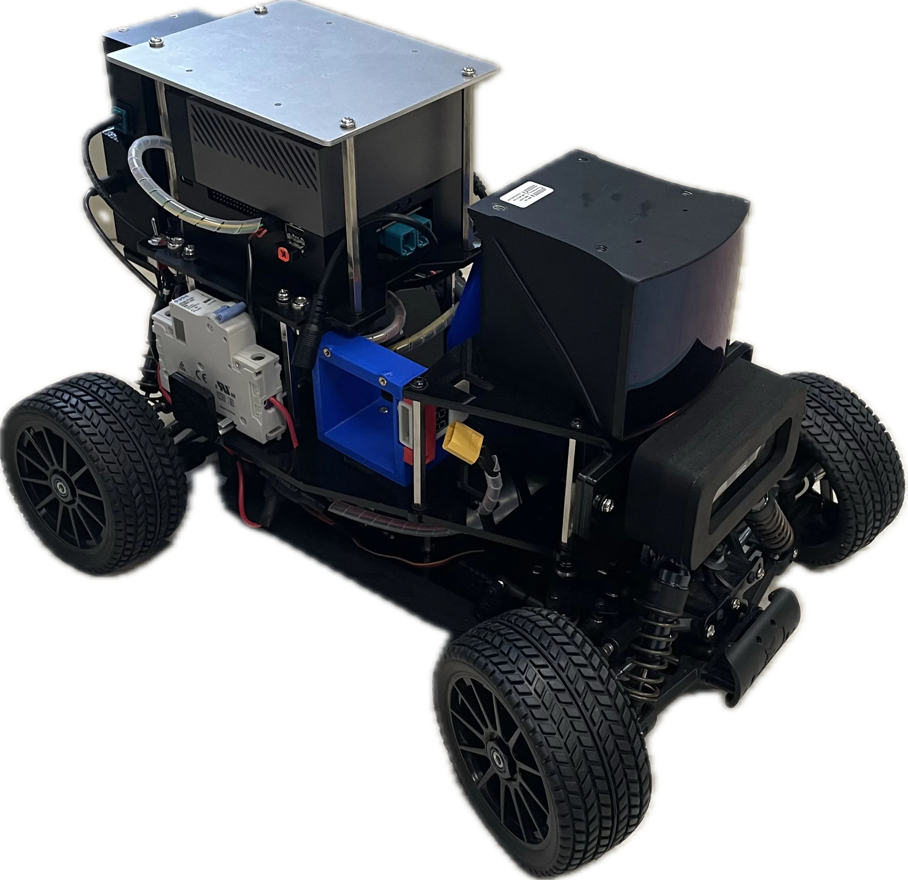
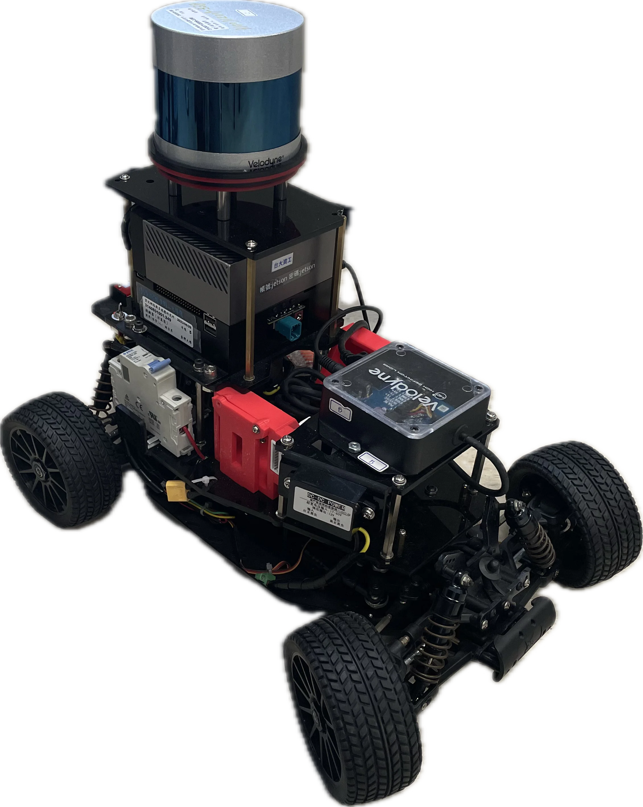

# Overview

  

The AutoSDV project (Autoware Software-Defined Vehicle) is an affordable 1/10 scale autonomous driving platform developed by NEWSLab at National Taiwan University. It provides a complete stack from hardware specifications to software implementation for educational and research institutes.

## Platform Models

| Feature | Base | 360° LiDAR | Solid-State | Connected |
|---------|------|------------|-------------|-----------|
| **LiDAR** | None | Velodyne VLP-32C | Seyond Robin-W | Seyond Robin-W |
| **LiDAR FOV** | - | 360° × 40° | 120° × 25° | 120° × 25° |
| **LiDAR Range** | - | 100m | 150m | 150m |
| **Localization** | Vision only | NDT (full autonomous) | Development needed | Development needed |
| **Connectivity** | Standard | Standard | Standard | 5G (Ataya/MOXA) |
| **Battery Life** | 40 min | 40 min | 40 min | 40 min |

<table align="center" border="0" style="margin: 2em 0;">
  <tr>
    <td align="center" valign="bottom">
      
    </td>
    <td align="center" valign="bottom">
      
    </td>
    <td align="center" valign="bottom">
      
    </td>
  </tr>
  <tr>
    <td align="center"><b>Solid-State LiDAR</b></td>
    <td align="center"><b>360° LiDAR</b></td>
    <td align="center"><b>5G Connected</b></td>
  </tr>
</table>

## Core Components

| Component | Specification |
|-----------|---------------|
| **Chassis** | Tekno TKR9500 (16×11×5 inch) |
| **Computer** | NVIDIA Jetson AGX Orin 64GB |
| **Storage** | 1TB NVMe SSD |
| **Camera** | ZED X Mini Stereo |
| **IMU** | MPU9250 9-axis |
| **Motor** | Brushless 4274/1500kv |

## Software

AutoSDV runs on Autoware with ROS 2, providing autonomous navigation capabilities for outdoor environments.

| Component | Details |
|-----------|---------|
| **Autoware** | Autoware.universe |
| **ROS** | ROS 2 Humble |
| **Source Code** | [GitHub](https://github.com/NEWSLabNTU/AutoSDV) |

## Resources

- **Documentation**: [AutoSDV Book](https://newslabntu.github.io/autosdv-book/)
- **Source Code**: [GitHub Repository](https://github.com/NEWSLabNTU/AutoSDV)
- **Issues**: [GitHub Issues](https://github.com/NEWSLabNTU/AutoSDV-book/issues)

## Contributors

- NEWSLab, National Taiwan University (Hsiang-Jui Lin, Chi-Sheng Shih)
