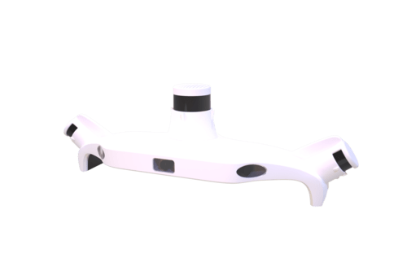
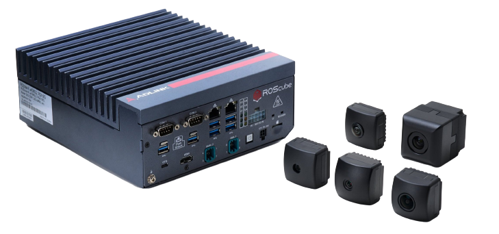
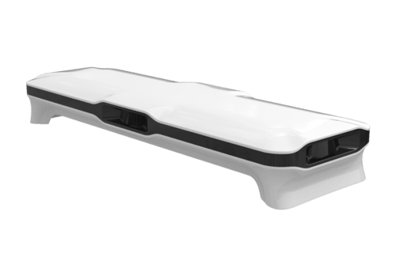

# AD Sensor Kit Suppliers

## **LEO Drive AD Sensor Kit**

LEO Drive Autonomy Essentials Kit contents are listed below:

| Supported Products List | Camera                  | Lidar                                                              | GNSS/INS         | ROS2 Support | Autoware Tested (Y/N) |
| ----------------------- | ----------------------- | ------------------------------------------------------------------ | ---------------- | ------------ | --------------------- |
| Autonomy Essentials Kit | 8x Lucid Vision TRI054S | 4x Velodyne Puck 1x Velodyne Alpha Prime 1x RoboSense Bpearl | 1x SBG Ellipse-D | Y            | Y                     |

Link to company website:  
[https://leodrive.ai/](https://leodrive.ai/)

## **TIER IV AD Kit**

Tier IV sensor fusion system contents are listed below:

| Supported Products List | Camera         | Lidar                            | ECU                        | ROS 2 Support | Autoware Tested (Y/N) |
| ----------------------- | -------------- | -------------------------------- | -------------------------- | ------------ | --------------------- |
| TIER IV ADK             | TIER IV C1, C2 | HESAI (AT-128,XT-32) Velodyne | ADLINK (RQX-58G, AVA-3510) | Y            | Y                     |

Link to company website:  
[https://sensor.tier4.jp/sensor-fusion-system](https://sensor.tier4.jp/sensor-fusion-system)

## **RoboSense AD Sensor Kit**

RoboSense L4 sensor fusion solution system contents are listed below:

| Supported Products List | Camera | Lidar                                 | ECU      | ROS2 Support | Autoware Tested (Y/N) |
| ----------------------- | ------ | ------------------------------------- | -------- | ------------ | --------------------- |
| P6                      | -      | 4x Automotive Grade Solid-state Lidar | Optional | -            | -                     |

Link to company website:  
[https://www.robosense.ai/en/rslidar/RS-Fusion-P6](https://www.robosense.ai/en/rslidar/RS-Fusion-P6)
