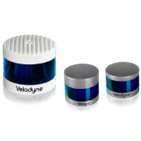

# LIDARs

## **Velodyne 3D LIDAR Sensors**

Velodyne Lidars which has ROS 2 driver and tested by one or more community members are listed below:

| Supported Products List | Range | FOV (V), (H)          | ROS 2 Driver | Autoware Tested (Y/N) |
| ----------------------- | ----- | --------------------- | ------------ | --------------------- |
| Alpha Prime             | 245m  | (+15°)/(-25°), (360°) | Y            | Y                     |
| Ultra Puck              | 200m  | (+15°)/(-25°), (360°) | Y            | Y                     |
| Puck                    | 100m  | (+15°)/(-15°), (360°) | Y            | Y                     |
| Puck Hi-res             | 100m  | (+10°)/(-10°), (360°) | Y            | Y                     |

Link to ROS 2 drivers:  
[https://github.com/tier4/nebula](https://github.com/tier4/nebula)  
[https://github.com/ros-drivers/velodyne/tree/ros2/velodyne_pointcloud](https://github.com/ros-drivers/velodyne/tree/ros2/velodyne_pointcloud)  
[https://gitlab.com/autowarefoundation/autoware.auto/AutowareAuto/-/tree/master/src/drivers/velodyne_nodes](https://gitlab.com/autowarefoundation/autoware.auto/AutowareAuto/-/tree/master/src/drivers/velodyne_nodes)
[https://github.com/autowarefoundation/awf_velodyne/tree/tier4/universe](https://github.com/autowarefoundation/awf_velodyne/tree/tier4/universe)

Link to company website:  
[https://velodynelidar.com/](https://velodynelidar.com/)

## **RoboSense 3D LIDAR Sensors**

RoboSense Lidars which has ROS 2 driver and tested by one or more community members are listed below:

| Supported Products List | Range | FOV (V), (H)                         | ROS 2 Driver | Autoware Tested (Y/N) |
| ----------------------- | ----- | ------------------------------------ | ------------ | --------------------- |
| M1                      | 200m  | 25°/120°                             | -            | -                     |
| E1                      | 30m   | 90°/120°                             | -            | -                     |
| Bpearl                  | 100m  | 90°/360°                             | Y            | Y                     |
| Ruby Plus               | 250m  | 40°/360°                             | Y            | ?                     |
| Helios 32               | 150m  | 70°/360°  31°/360°  26°/360° | Y            | Y                     |
| Helios 16               | 150m  | 30°/360°                             | Y            | ?                     |

Link to ROS 2 driver:  
[https://github.com/RoboSense-LiDAR/rslidar_sdk](https://github.com/RoboSense-LiDAR/rslidar_sdk)

Link to company website:  
[https://www.robosense.ai/](https://www.robosense.ai/)

## **HESAI 3D LIDAR Sensors**

Hesai Lidars which has ROS 2 driver and tested by one or more community members are listed below:

| Supported Products List | Range | FOV (V), (H)            | ROS 2 Driver | Autoware Tested (Y/N) |
| ----------------------- | ----- | ----------------------- | ------------ | --------------------- |
| Pandar 128              | 200m  | (+15°)/(-25°), (360°)   | Y            | -                     |
| Pandar 64               | 200m  | (+15°)/(-25°), (360°)   | Y            | Y                     |
| Pandar 40P              | 200m  | (+15°)/(-25°), (360°)   | Y            | Y                     |
| QT 128                  | 50m   | (-52.6°/+52.6°), (360°) | Y            | Y                     |
| QT 64                   | 20m   | (-52.1°/+52.1°), (360°) | Y            | Y                     |
| AT128                   | 200m  | (25.4°), (120°)         | Y            | Y                     |
| XT32                    | 120m  | (-16°/+15°), (360°)     | Y            | Y                     |
| XT16                    | 120m  | (-15°/+15°), (360°)     | Y            | -                     |
| FT120                   | 100m  | (75°), (100°)           | -            | -                     |
| ET25                    | 250m  | (25°), (120°)           | -            | -                     |

Link to ROS 2 drivers:  
[https://github.com/tier4/nebula](https://github.com/tier4/nebula)  
[https://github.com/HesaiTechnology/HesaiLidar_General_ROS](https://github.com/HesaiTechnology/HesaiLidar_General_ROS)

Link to company website:  
[https://www.hesaitech.com/en/](https://www.hesaitech.com/en/)

## **Leishen 3D LIDAR Sensors**

Leishen Lidars which has ROS 2 driver and tested by one or more community members are listed below:

| Supported Products List | Range | FOV (V), (H)         | ROS 2 Driver | Autoware Tested (Y/N) |
| ----------------------- | ----- | -------------------- | ------------ | --------------------- |
| LS C16                  | 150m  | (+15°/-15°), (360°)  | Y            | -                     |
| LS C32                  | 150m  | (+15°/-15°), (360°)  | Y            | -                     |
| CH 32                   | 120m  | (+3.7°/-6.7°),(120°) | Y            | -                     |
| CH 128                  | 20m   | (+14°/-17°)/(150°)   | Y            | -                     |
| C32W                    | 160m  | (+15°/-55°), (360°)  | Y            | -                     |

Link to ROS 2 driver:  
[https://github.com/leishen-lidar](https://github.com/leishen-lidar)

Link to company website:  
[http://www.lslidar.com/](http://www.lslidar.com/)

## **Livox 3D LIDAR Sensors**

Livox Lidars which has ROS 2 driver and tested by one or more community members are listed below:

| Supported Products List | Range | FOV (V), (H)       | ROS 2 Driver | Autoware Tested (Y/N) |
| ----------------------- | ----- | ------------------ | ------------ | --------------------- |
| Horizon                 | 260m  | (81.7°), (25.1°)   | Y            | Y                     |
| Mid-40                  | 260m  | (38.4°), Circular  | Y            | -                     |
| Mid-70                  | 90m   | (70.4°), (77.2°)   | Y            | -                     |
| Mid-100                 | 260m  | (38.4°), (98.4°)   | Y            | -                     |
| Mid-360                 | 70m   | (+52°/-7°), (360°) | Y            | -                     |
| Avia                    | 190m  | (70.4°), Circular  | Y            | -                     |
| HAP                     | 150m  | (25°), (120°)      | -            | -                     |
| Tele-15                 | 320m  | (16.2°), (14.5°)   | -            | -                     |

Link to ROS 2 driver:  
[https://github.com/Livox-SDK/livox_ros2_driver](https://github.com/Livox-SDK/livox_ros2_driver)

Link to company website:  
[https://www.livoxtech.com/](https://www.livoxtech.com/)

## **Ouster 3D LIDAR Sensors**

Ouster Lidars which has ROS 2 driver and tested by one or more community members are listed below:

| Supported Products List | Range | FOV (V), (H)    | ROS 2 Driver | Autoware Tested (Y/N) |
| ----------------------- | ----- | --------------- | ------------ | --------------------- |
| OSDome                  | 45m   | (180°), (360°)  | Y            | -                     |
| OS0                     | 100m  | (90°), (360°)   | Y            | -                     |
| OS1                     | 200m  | (45°), (360°)   | Y            | -                     |
| OS2                     | 400m  | (22,5°), (360°) | Y            | Y                     |

Link to ROS 2 driver:  
[https://github.com/ros-drivers/ros2_ouster_drivers](https://github.com/ros-drivers/ros2_ouster_drivers)

Link to company website:  
[https://ouster.com/](https://ouster.com/)
