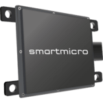
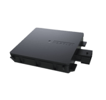
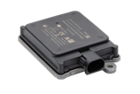

# RADARs

## **Smartmicro Automotive Radars**

Smartmicro Radars which has ROS 2 driver and tested by one or more community members are listed below:

| Supported Products List                        | Range                                                                 | FOV (Azimuth), (Elevation)                  | ROS 2 Driver | Autoware Tested (Y/N) |
| ---------------------------------------------- | --------------------------------------------------------------------- | ------------------------------------------- | ------------ | --------------------- |
| DRVEGRD 152 (Dual Mode Medium, Long)           | M: 0.33...66  m L: 0.9…180 m                                  | (100°), (20°)                               | Y            | -                     |
| DRVEGRD 169 (Ultra-Short, Short, Medium, Long) | US: 0.1…9.5 m  S: 0.2…19 m  M: 0.6...56 m  L: 1.3...130 m | US: (140°), (28°)  S/M/L: (130°), (15°) | Y            | -                     |
| DRVEGRD 171 (Triple Mode Short, Medium Long)   | S: 0.2...40 m  M: 0.5...100 m  L: 1.2...240 m                 | (100°), (20°)                               | Y            | -                     |

Link to ROS 2 driver:  
[https://github.com/smartmicro/smartmicro_ros2_radars](https://github.com/smartmicro/smartmicro_ros2_radars)

Link to company website:  
[https://www.smartmicro.com/automotive-radar](https://www.smartmicro.com/automotive-radar)

## **Aptiv Automotive Radars**

Aptiv Radars which has ROS 2 driver and tested by one or more community members are listed below:

| Supported Products List                  | Range                    | FOV (Azimuth), (Elevation)              | ROS 2 Driver | Autoware Tested (Y/N) |
| ---------------------------------------- | ------------------------ | --------------------------------------- | ------------ | --------------------- |
| Aptiv MMR (Dual Mode Short, Long)        | S: 1...40 m L: 3...160 m | Short.: (90), (90°) Long: (90°), (90°)  | Y            | -                     |
| Aptiv ESR 2.5 (Dual Mode (Medium, Long)) | M: 1...60 m L: 1...175 m | Med.: (90°), (4.4°) Long: (20°), (4.4°) | Y            | -                     |

Link to company website:  
[https://autonomoustuff.com/products](https://autonomoustuff.com/products)

## **Continental Engineering Radars**

Continental Engineering Radars which has ROS 2 driver and tested by one or more community members are listed below:

| Supported Products List | Range                     | FOV (Azimuth), (Elevation)                  | ROS 2 Driver | Autoware Tested (Y/N) |
| ----------------------- | ------------------------- | ------------------------------------------- | ------------ | --------------------- |
| ARS404                  | Near: 70m   Far: 170m | Near: (90°), (18°)   Far: (18°), (18°)  | -            | -                     |
| ARS408                  | Near: 20m   Far: 250m | Near: (120°), (20°)   Far: (18°), (14°) | -            | -                     |

Link to ROS 2 driver:  
[https://github.com/tier4/ars408_driver](https://github.com/tier4/ars408_driver)

Link to company website:  
[https://conti-engineering.com/components/ars430/](https://conti-engineering.com/components/ars430/)
