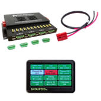
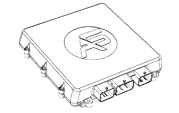
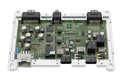

# Vehicle Drive By Wire Suppliers

## **Dataspeed DBW Solutions**

Dataspeed DBW Controllers which is used for autonomous driving and tested by one or more community members are listed below:

| Supported Vehicles                                                                                                                                                  | Power                            | Remote Control      | ROS 2 Support | Autoware Tested (Y/N) |
| ------------------------------------------------------------------------------------------------------------------------------------------------------------------- | -------------------------------- | ------------------- | ------------- | --------------------- |
| Lincoln MKZ, Nautilus Ford Fusion, F150, Transit Connect, Ranger Chrysler Pacifica Jeep Cherokee Polaris GEM, RZR, Lincoln Aviator, Jeep Grand Cherokee | 12 Channel PDS,15 A Each at 12 V | Optional, Available | Y             | -                     |

Link to company website:  
[https://www.dataspeedinc.com/](https://www.dataspeedinc.com/)

## **AStuff Pacmod DBW Solutions**

Autonomous Stuff Pacmod DBW Controllers which is used for autonomous driving and tested by one or more community members are listed below:

| Supported Vehicles                                                                                                                                                             | Power                    | Remote Control      | ROS 2 Support | Autoware Tested (Y/N) |
| ------------------------------------------------------------------------------------------------------------------------------------------------------------------------------ | ------------------------ | ------------------- | ------------- | --------------------- |
| Polaris GEM Series Polaris eLXD MY 2016+ Polaris Ranger X900 International ProStar Lexus RX-450h MY Ford Ranger Toyota Minivan Ford Transit Honda CR-V | Power distribution panel | Optional, Available | Y             | Y                     |

Link to company website:  
[https://autonomoustuff.com/platform/pacmod](https://autonomoustuff.com/platform/pacmod)

  <!-- cspell: ignore Paravan -->

## **Schaeffler-Paravan Space Drive DBW Solutions**

Schaeffler-Paravan Space Drive DBW Controllers which is used for autonomous driving and tested by one or more community members are listed below:

| Supported Vehicles                | Power | Remote Control      | ROS 2 Support | Autoware Tested (Y/N) |
| --------------------------------- | ----- | ------------------- | ------------- | --------------------- |
| Custom Integration with Actuators | -     | Optional, Available | Y             | Y                     |

Link to company website:  
[https://www.schaeffler-paravan.de/en/products/space-drive-system/](https://www.schaeffler-paravan.com/en/space-drive/space-drive-2-already-home-streets-world)
