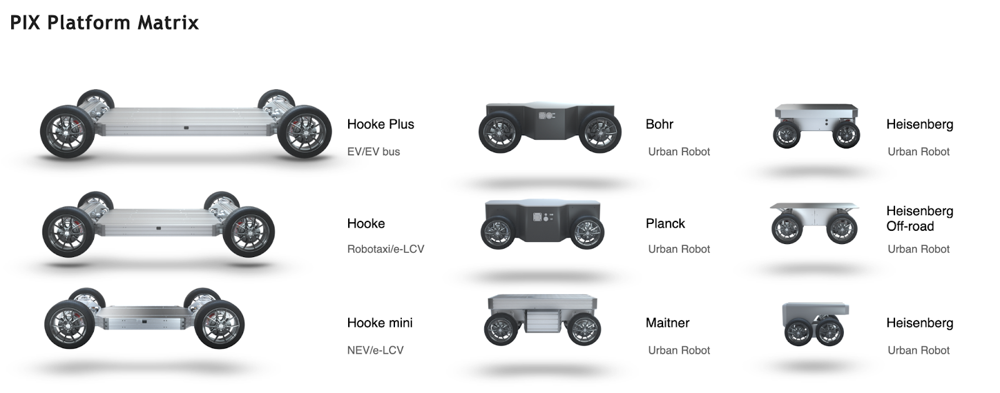

# Vehicle Platform Suppliers

## **PIX MOVING Autonomous Vehicle Solutions**

PIX Moving AV solutions which is used for autonomous development and tested by one or more community members are listed below:

| Vehicle Types                      | Sensors Integrated | Autoware Installed | ROS 2 Support | Autoware Tested (Y/N) |
| ---------------------------------- | ------------------ | ------------------ | ------------ | --------------------- |
| Electric DBW Chassis and Platforms | Y                  | Y                  | Y            | -                     |

Link to company website:  
[https://www.pixmoving.com/pixkit](https://www.pixmoving.com/pixkit)

Different sizes of platforms

## **Autonomoustuff AV Solutions**

Autonomoustuff platform solutions which is used for autonomous development and tested by one or more community members are listed below:

| Vehicle Types                      | Sensors Integrated | Autoware Installed | ROS 2 Support | Autoware Tested (Y/N) |
| ---------------------------------- | ------------------ | ------------------ | ------------ | --------------------- |
| Road Vehicles, Golf Carts & Trucks | Y                  | Y                  | Y            | -                     |

Link to company website:  
[https://autonomoustuff.com/platform](https://autonomoustuff.com/platform)

## **NAVYA AV Solutions**

NAVYA platform solutions which is used for autonomous development and tested by one or more community members are listed below:

| Vehicle Types                      | Sensors Integrated | Autoware Installed | ROS 2 Support | Autoware Tested (Y/N) |
| ---------------------------------- | ------------------ | ------------------ | ------------ | --------------------- |
| Shuttle Bus, Taxi and Tow Tractors | Y                  | Y                  | -            | -                     |

Link to company website:  
[https://navya.tech/en](https://navya.tech/en)

## **ZING ROBOTICS AV Solutions**

ZING Robotics platform solutions which is used for autonomous development and tested by one or more community members are listed below:

| Vehicle Types                                                          | Sensors Integrated | Autoware Installed | ROS 2 Support | Autoware Tested (Y/N) |
| ---------------------------------------------------------------------- | ------------------ | ------------------ | ------------ | --------------------- |
| Purpose built electric autonomous vehicles for aviation, military etc. | Y                  | Y                  | -            | -                     |

Link to company website:  
[https://www.zingrobotics.com/](https://www.zingrobotics.com/)
