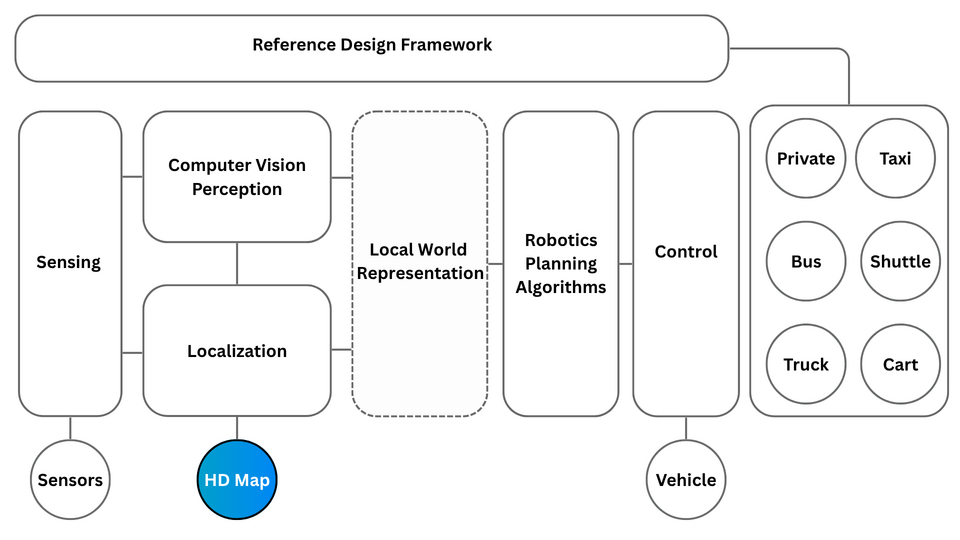
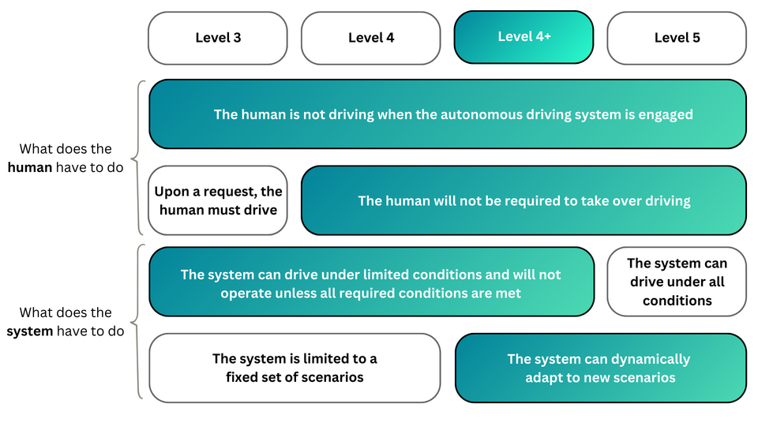
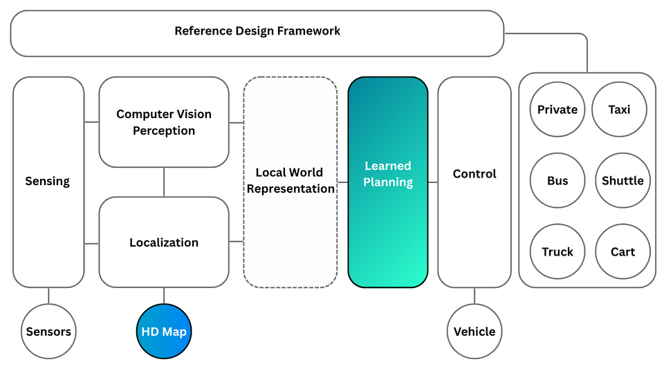
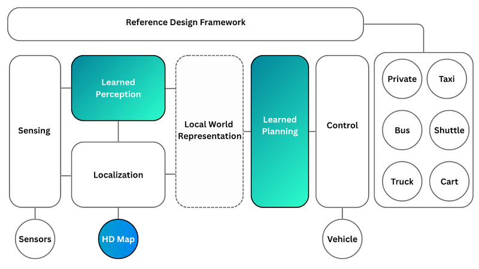
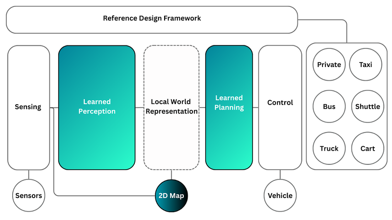
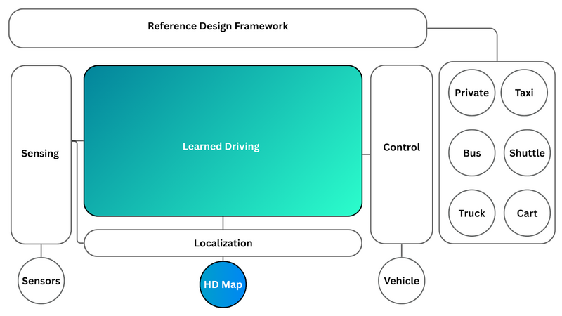
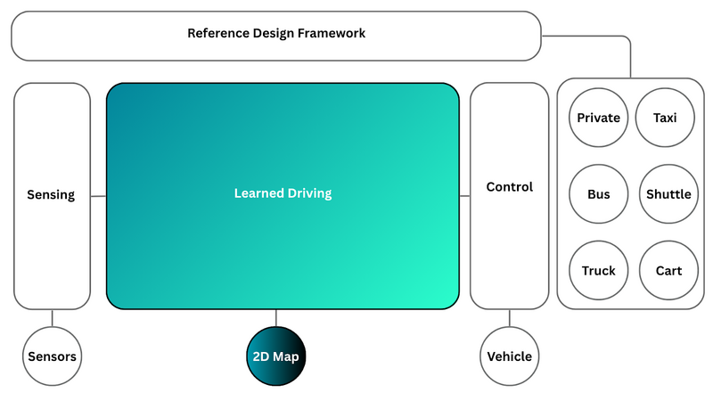
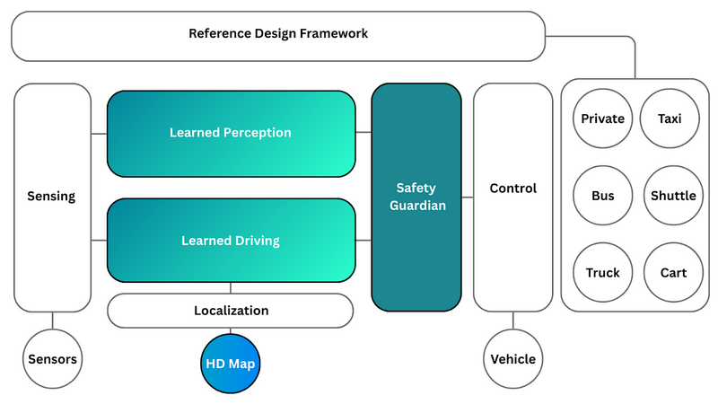
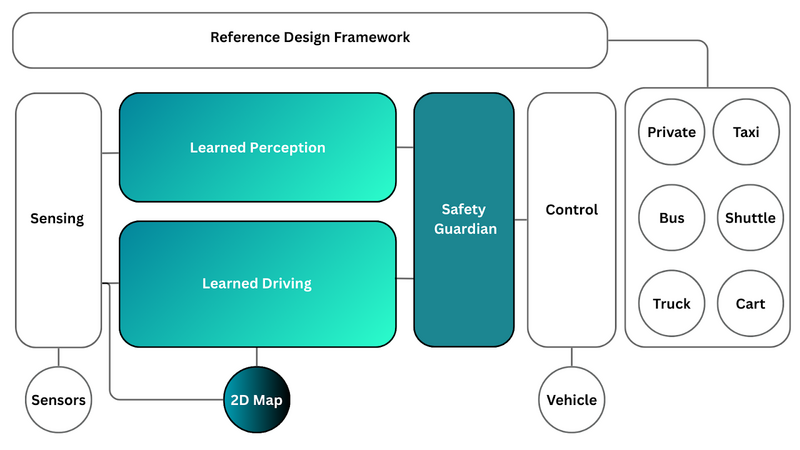

# Autonomous Driving Stack Architecture

## Traditional Robotics Stack

<strong>Figure 1:</strong> Architecture diagram of traditional robotics stack for autonomous driving

Early architectures for autonomous driving were architected as per a traditional robotics stack comprising hand-coded algorithms for perception, localization and planning, as illustrated in Figure 1. Whilst such approaches are able to achieve robust performance in known scenarios and constrained Operational Design Domains, there are certain drawbacks of this classical architecture.

These include difficulty in handling previously unseen scenarios, challenges in code upgrades for new features, driving behaviour which doesn’t match natural human driving styles, and challenges in addressing negotiated driving maneuvers such as merges, nudges, giving way and taking way.

## Introduction to Autoware E2E

Autoware E2E (End-to-End) describes the next evolution in the autonomous driving implementation of the Autoware project, from a traditional robotics stack towards an AI-first, data-centric stack powered by End-to-End autonomous driving features.

This evolution is being driven by our core value of developing ‘cutting edge’ technologies, as well as our desire to offer the autonomous driving community with a new open-source technology paradigm, powered by data-centric AI.

The Autoware E2E stack aims to achieve global scalability across (Operational Design Domains) ODDs by utilizing data-centric End-to-End AI through which hand-coded modules will be replaced in a modular and incremental fashion by neural networks - which have shown great promise in being able to handle diverse and complex driving scenarios across domains.

<strong>Figure 2:</strong> Definition of SAE Level 4+ autonomous driving

In particular, we aim to achieve SAE Level 4+ autonomous driving functionality through Autoware E2E, in which the autonomous system is able to operate without any human intervention and is able to dynamically adapt to new scenarios which the system has not previously encountered - as illustrated in Figure 2.

## Autoware E2E Architecture Description

The Autoware E2E architecture will be implemented in an evolutionary fashion in three key steps, wherein each subsequent step builds on top of the technology capabilities developed in earlier steps. This stepwise approach is being utilized to ensure that a smooth transition can be implemented without introducing breaking changes and allowing for thorough evaluation and testing of learned AI-based modules as they are introduced.

### Step 1 - Learned Planner

Step 1 aims to introduce a learned planning module which is able to ingest a world state consisting of the ego-vehicle’s localized position with respect to an HD map, alongside key perception information including elements such as 3D bounding boxes of other foreground objects, traffic light state etc.

<strong>Figure 3:</strong> Autoware E2E - Learned Planning architecture

The learned planning module is able to take this ‘local world representation’ from upstream perception and localization processes and devises an optimal trajectory which aligns with the overall navigation goal as determined by the mission plan.

The advantages of a learned local planner are that complex negotiated traffic scenarios such as merges, nudges and giving way can be learned from human driving data and do not need to be hand-coded. Additionally, the model can be trained on data from different cities to better learn local driving styles which match the temperament of drivers - for example, driving in London is very different from driving in Mumbai.

### Step 2 - Component Based End-to-End AI - Learned Perception & Learned Planner

Step 2 builds on top of the milestone achievement of Step 1 and introduces learned perception, such that the ‘local world representation’ is also learned rather than based on hand-coded algorithms. At this stage, an HD map and localizer can be used (option A), or, the vehicle can create a ‘local map’ implicitly through Learned Perception which estimates the potential driving corridors and localizes key scene elements with respect to the ego-vehicle, most often utilizing a 2D map (option B).

Option A:

<strong>Figure 4:</strong> Autoware E2E - Learned Perception and Learned Planning supported by an HD-map

Option B:

<strong>Figure 5:</strong> Autoware E2E - Learned Perception and Learned Planning supported by a standard 2D-map

In Step 2, the entire autonomous driving stack is learned and trainable End-to-End, however, there is an interface between the learned perception module and the learned planning module, where the outputs of the learned perception modules need to satisfy the requirements of the learned planning module. This approach decouples perception and planning and allows for introspection of the full End-to-End stack, allowing for easier debugging and testing.

The advantage of Option B is that the system will be available wherever a 2D map is present, allowing for larger geographic coverage from the outset since HD-map construction and maintenance is not required. However, Option A would benefit from increased robustness by the inclusion of the HD-map, providing the vehicle with additional information about the shape of the road, key infrastructure elements, and potential driving corridors of other road actors.

### Step 3 - Learned driving

Step 3 builds on top of the developments in Step 2 to create a single Learned Driving, monolithic neural network, which internally learns a ‘local world representation’ without any explicit learned perception or planning modules - there is no traffic light detection, semantic segmentation, or lane detection - all these factors are represented implicitly in the model’s feature space. The earlier features are fed to a decoder which estimates a single ideal driving trajectory which is tracked by a closed loop controller. The motivation of such monolithic approaches is that they do not constrain the perceptual elements that should be extracted for optimal local planning - allowing the stack to learn unique scene level features and their interdependent relationships for full End-to-End driving.

Similar to Step 2, there are two options which can be leveraged to implement Step 3. In Option A, an HD map is utilized to provide the vehicle with detailed scene information - almost acting as a non-line-of-sight capable sensor for the static environment, encoding data such as positions of traffic lights, road geometry, lane topologies, rights of way etc. In option B, a sat-nav style 2D/ADAS map is utilized, which forces the Learned Driving model to build an internal feature-level representation of the same information as would be encoded with the HD map.

Option A:

<strong>Figure 6:</strong> Autoware E2E - Monolithic Learned Driving model supported by an HD-map

Option B:

<strong>Figure 7:</strong> Autoware E2E - Monolithic Learned Driving model supported by a standard 2D-map

Multiple Neural network architectures can be applied for ‘Learned Driving’ models, however, they can broadly be categorised as belonging to two types; convolutional neural network models and vision-language-action models.

#### Convolutional Neural Network Models

Convolutional Neural Network models usually rely upon two stages within the model. In the first stage, sensor data is passed through a ‘Feature Backbone’ which is responsible for extracting and capturing general-purpose image features which represent the content of the scene. These features are then fed into a second stage, often referred to as a ‘Policy Model’, which usually consists of fully-connected neural network layers which are responsible for predicting the future trajectory of the vehicle.

The advantage of Convolutional Neural Network models is that, based on careful selection of the feature backbone and policy model design, the model can be deployed on embedded edge hardware devices and be trained on a smaller set of data samples compared to larger, more complex models. However, a significant limitation of Convolutional Neural Network models is that they may not be able to capture the overall scene context and relationship between scene elements, and instead can only capture higher level features corresponding to the presence of shapes, or object elements - leading to a potential drop in performance and model generalizability.

<strong>Figure 8:</strong> Autoware E2E - Learned Driving - Convolutional Neural Network Implementation

#### Vision Language Action Models

An alternative architecture for Learned Driving is based on Vision-Language-Action models. These models utilize a combination of Vision Transformers and Large Language Models to jointly learn image features, scene context and reason about driving decisions.

The model can be conditioned on learned queries or text inputs, for example ‘continue straight along the road’ and the model can execute a driving policy to follow these commands. A diffusion transformer model decodes the network features to output the driving action in the form of a trajectory and can also optionally output text, which aims to explain the reasoning through which the model predicted the trajectory - helping with model introspection and explainability.

<strong>Figure 9:</strong> Autoware E2E - Learned Driving - Vision Language Action Model Implementation

#### Open Challenges with Learned Driving

Although both Convolutional Neural Network architectures and Vision-Language-Action models present viable options at executing Learned Driving, and demonstrate great promise and potential, there still remain challenges with these approaches. One of the most important challenges is that the entire autonomous driving stack is learned and executed in a single forward pass of a large monolithic neural network, which can be difficult to train and debug, since there are no explicit scene level representations - only representations inside the neural network’s feature space. Such Learned Driving networks are also difficult to validate, since it is challenging to truly understand ‘what the network has learned’ in feature space. Such approaches are also limited by the quality of training data - for example, a naive approach which simply applies Imitation Learning may learn to follow human drivers which disobey traffic rules, such as not stopping at a stop sign - making data cleanliness of utmost importance.

### Step 4 - Learned Hybrid approach - (Under development by industry)

In order to have the best of both worlds, in Step 4, a Learned Hybrid approach can be adopted which combines a Learned Driving model alongside complementary Safety Perception modules allowing for redundancy and greater built-in safety and introspection as well as diversity in sensing. Similar to prior steps, there are options to support either an HD-map or a 2D-map interface.

#### Safety Perception

Safety Perception comprises dedicated perception modules which play a key role in helping to ensure that rare edge case scenarios which may not be appropriately handled by a Learned Driving model, do not result in collisions.While the Learned Driving model can rely upon camera-based sensing, Safety Perception modules can leverage physics-based 3D sensors such as LIDAR and RADAR. To improve introspectability, Safety Perception modules can utilize rule-based implementations allowing for complete transparency, or alternatively, they can also be Learned Perception models.

The motivation of this is to help autonomous vehicles achieve a super-human capability by leveraging sensing modalities not available to human drivers, who rely upon vision based driving alone. LIDAR and RADAR provide excellent perceptual redundancy and robustness in adverse weather conditions such as fog, rain, heavy snow, and dust storms as well as challenging lighting conditions such as pitch-black, or sun glare.

#### Safety Guardian

A Safety Guardian module is responsible for cross-referencing the Safety Perception outputs with the Learned Driving predictions to avoid safety-critical edge-case scenarios where, for example, the Learned Driving model may not be able to see an obstacle due to adverse weather or occlusion, and the Safety Perception modules can fill this safety gap. Additionally, the Safety Guardian can utilize infrastructure-based scene perception data or other connected vehicle data via V2X (vehicle to infrastructure communication) if it is available to further enhance safety of the self-driving system. Similar to Steps 2, 3 - Step 4 can also be implemented with optional support for either an HD map or a standard 2D/ADAS map.

Option A:

<strong>Figure 10:</strong> Autoware E2E - Learned Hybrid model supported by an HD-map

Option B:

<strong>Figure 11:</strong> Autoware E2E - Learned Hybrid model supported by a standard 2D-map

