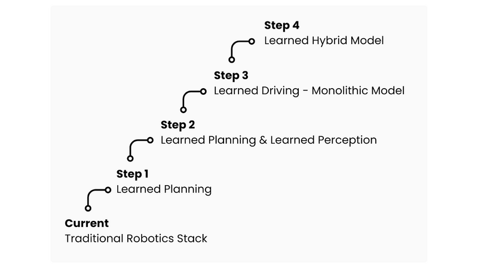
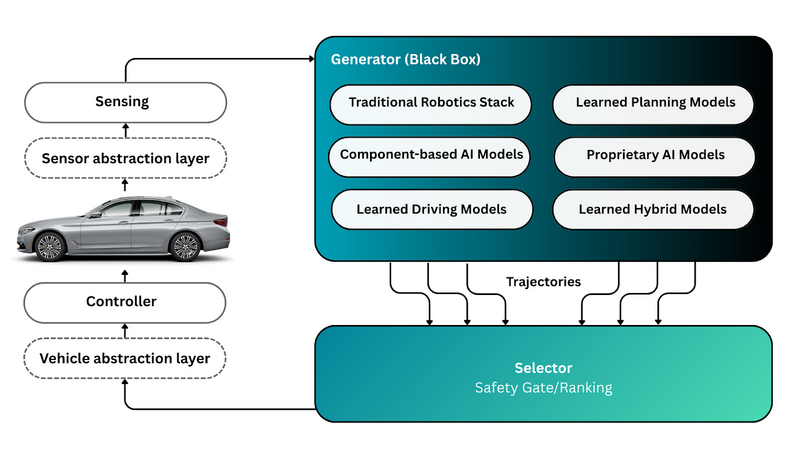

# Detailed Architectural Interface

## Requirements and Considerations

In order to introduce End-to-End autonomous driving technologies within Autoware open-source project, we have set the following high level software design requirements for the new Autoware E2E architecture implementation and software interfaces:

### 1. Define a Robust, Consistent Interface Across Evolutionary Steps

As explained in the earlier section titled [Autonomous Driving Stack Architecture](./autonomous-driving-stack-architecture.md) we plan to take the following evolutionary steps towards implementing End-to-End autonomous driving.

<strong>Figure 1:</strong> Stepwise technology evolution

We aim to avoid disruptive changes to core interfaces at each stage. This ensures users can adopt new End-to-End AI modules incrementally, without requiring major rewrites. Moreover, some users may prefer to retain classical rule-based planners for specific scenarios (e.g., deterministic planning). By preserving interface consistency, we allow these users to easily switch between End-to-End AI and traditional approaches as needed.

### 2. Introduce a Framework for Minimum Safety Guarantees

A major challenge with End-to-End AI models is their black-box nature, making it difficult to verify whether the generated trajectories are safe and valid. To address this, the architecture must incorporate a post-processing phase that enforces safety constraints on neural network outputs.

These safety requirements may vary across users and applications. Therefore, the framework should support easy customization, allowing developers to define and enforce domain-specific safety policies.

### 3. Support User-Defined Behavior Preferences

In autonomous driving, many decisions are inherently non-deterministic. For example, the timing of a lane change often depends on driver preference and context, both maintaining the current lane and changing lanes can be equally valid choices.

Some E2E planners, such as the Diffusion Drive planner, can generate multiple feasible trajectories in such scenarios. However, the vehicle must ultimately commit to a single maneuver. Therefore, the architecture must support a mechanism for users to influence decision-making, allowing their preferences to guide behavior selection when multiple valid options exist.

## Generator-Selector Framework

To flexibly accommodate these diverse approaches, we propose a Generator-Selector Framework. This framework consists of two core components:

- Generator: Generates candidate trajectories that the vehicle can follow.
- Selector: Selects the safest and most optimal trajectory from among the candidates.

<strong>Figure 2:</strong> Generator-Selector Framework

This framework enables unified handling of different autonomous driving architectures with varying levels of End-to-End AI technologies, while allowing safety and performance considerations to guide the final decision.

### Generator
The Generator can be any autonomous driving stack capable of generating candidate trajectories that the vehicle may follow. For example:
- Traditional Robotics stack: The existing Autoware stack can be reused as-is.
- Proprietary AI-Models: Autoware Foundation member companies can utilize their in-house models
- Open-Source End-to-End AI: Autoware E2E models

Multiple Generators can be executed in parallel or selectively activated depending on the context.

### Selector
The Selector is responsible for two main functions:

- Safety Gate (Safety Assurance)
  - Validates the output of black-box Generators (e.g., neural networks) to ensure a minimum level of safety. (e.g., check using an HD map to ensure that traffic signals are obeyed)
- Ranking (Trajectory Evaluation and Selection)
  - Evaluates and ranks the outputs from multiple Generators, then selects the best one.
    - Examples:
      - Use a robotics-based approach when an HD map is available; fall back to End-to-End AI models otherwise
      - Score trajectories based on driving policies such as safety, comfort, or rule compliance

These Selector functions are implemented as plugins, allowing developers to customize safety requirements and inject preferences to select a suitable trajectory for their own use case.

### Reference links:
- GitHub Discussions:
  - https://github.com/orgs/autowarefoundation/discussions/5033
  - https://github.com/orgs/autowarefoundation/discussions/6301
- Proposed Architecture Interface: https://github.com/tier4/new_planning_framework/wiki
- Migration plan for introducing new generator-selector framework: [Enable generator-selector planning framework #6292](https://github.com/autowarefoundation/autoware.universe/pull/6292)
