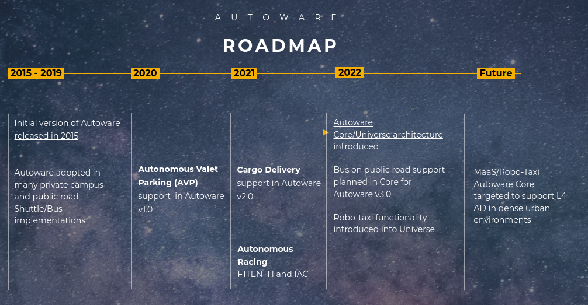

# Roadmap
This page describes planned work for Autoware.

## High Level Roadmap

The long term roadmap of Autoware is determined by the TSC of the Autoware Foundation.
Above image shows the current high level roadmap of Autoware.

Currently Autoware aims to achieve Robo-taxi/PoV Curb-to-Curb L4 autonomous driving on public roads in 2025. This includes route which includes dense urban and highway use cases (e.g. home to airport in dense urban area including highway segments).
Autoware will have annual release with incremental feature added towards the 2025 goal with practical demonstrations of capabilities.

## Planned Releases
**Autoware v3.0**
The release will include function to support public bus driving.
The supported use case scenarios are detailed out by the ODD Working Group and is listed in [this document](https://docs.google.com/presentation/d/1VZ3TZU295uVFvYrE4AjL1X8ebwmslcNkCCL2UTMlXJU/edit#slide=id.gd38c585fc3_0_0).

## Feature Ideas
|Use Case| Features | Owner | Expected Completion
|--|--|--|--|
|Bus ODD| Autoware.Core Stabilization| Autonomy Software WG
|Improved object detection|Sensor fusion including camera and radar for improved objection accuracy in predefined test cases
|Improved traffic light detection|V2X integration for communication with RSUs (Improved traffic light detection in high density environment with possible occlusions)
|High speed driving on freeways in low traffic density |Localization without using pointclouds
|Urban and freeway driving in high traffic density |Advanced multi-lane planning

## Other Planned Enhancements
* Software/Documentation/Tool Improvements
  * Clear compatible driver support for many sensors
  * Detailed end to end installation tutorial / support / training material and videos (timeless content)
  * https://autowarefoundation.github.io/autoware-documentation/main/ to be the main portal for all information related to starting and working with Autoware
  * Launch file gui for improved configurability / ease of use
  * Default gui for diagnostics monitoring and goal selection and mission visualization
  * Strengthening CI/CD process and the code base with tests to ensure main branch is always working against documentation
  * Better integration with simulation and enhanced simulation capabilities
  * Optimizing existing algorithms to run more efficiently and enable lower power devices (RViz and NDT and pointcloud operations on GPU version not working on Jetson)
  * Benchmarking against KITTI and Waymo datasets
* Open AD Kit (in alignment with SOAFEE and MIH, perhaps Eclipse)
  * Autoware release and containerization framework
  * Availability of hardware reference implementations
  * Heterogeneous platforms (e.g CPU+GPU/ACCL+MCU)
  * Cloud-native DevOps/MLOps integration
  * Freely Available/Open Source Solution based on Tool Improvements

