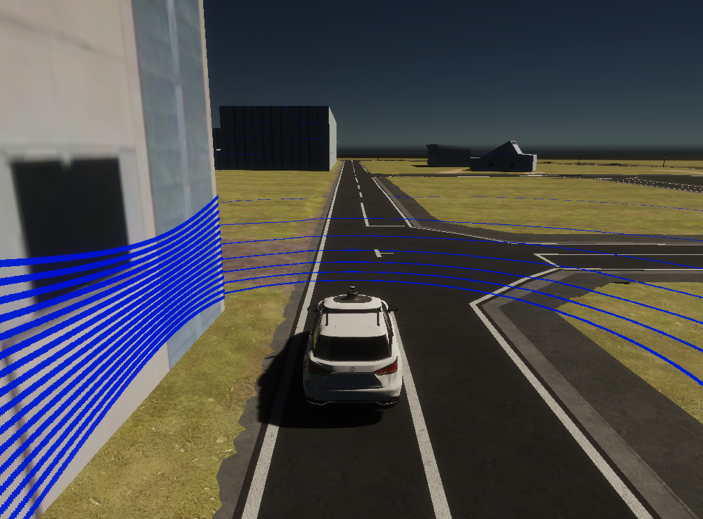
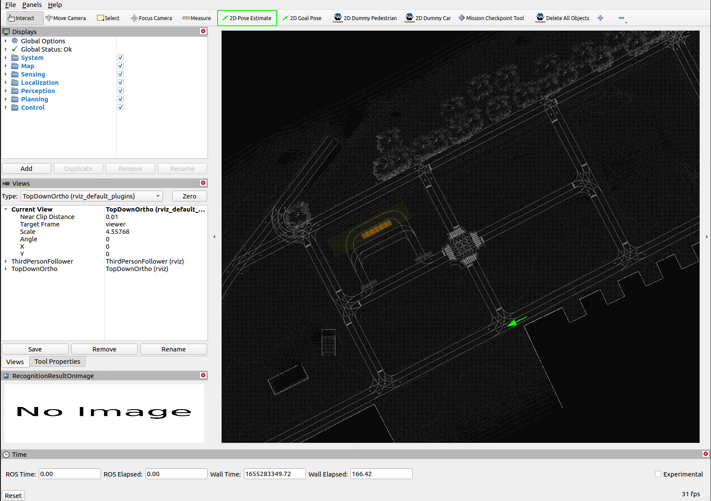
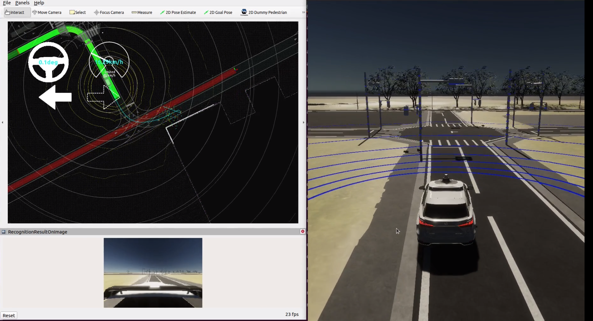
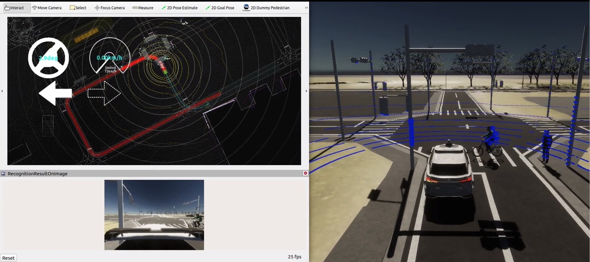

# AWSIM simulator setup

!!! note

    The binary is just a sample one for the initial testing, the official one from TIER IV will be released in October

## Hardware requirements

| Required PC Specs |                               |
| :---------------- | :---------------------------- |
| OS                | Ubuntu 20.04                  |
| CPU               | 6cores and 12thread or higher |
| GPU               | RTX2080Ti or higher           |

## Prerequisites

1. Nvidia GPU driver (Skip if already installed)
    1. Add Nvidia driver to apt repository
    ```bash
    sudo add-apt-repository ppa:graphics-drivers/ppa
    ```
    2. Check supported Nvidia driver versions
    ```bash
    $ ubuntu-drivers devices
    == /sys/devices/pci0000:00/0000:00:01.0/0000:01:00.0 ==
    modalias : pci:v000010DEd00001F91sv000017AAsd0000229Fbc03sc00i00
    vendor : NVIDIA Corporation
    driver : nvidia-driver-435 - distro non-free
    driver : nvidia-driver-440-server - distro non-free
    driver : nvidia-driver-418-server - distro non-free
    driver : nvidia-driver-450 - third-party free recommended
    driver : nvidia-driver-440 - distro non-free
    driver : xserver-xorg-video-nouveau - distro free builtin

    == /sys/devices/pci0000:00/0000:00:1d.6/0000:52:00.0 ==
    modalias : pci:v00008086d00002723sv00008086sd00000080bc02sc80i00
    vendor : Intel Corporation
    manual_install: True
    driver : backport-iwlwifi-dkms - distro free
    ```
    3. Install the recommended version
    ```bash
    sudo apt install nvidia-driver-450
    ```
    4. reboot and check nvidia-smi
    ```bash
    $ nvidia-smi
    Fri Aug 14 18:18:17 2020
    +-----------------------------------------------------------------------------+
    | NVIDIA-SMI 450.57 Driver Version: 450.57 CUDA Version: 11.0 |
    |-------------------------------+----------------------+----------------------+
    | GPU Name Persistence-M| Bus-Id Disp.A | Volatile Uncorr. ECC |
    | Fan Temp Perf Pwr:Usage/Cap| Memory-Usage | GPU-Util Compute M. |
    | | | MIG M. |
    |===============================+======================+======================|
    | 0 GeForce GTX 165... Off | 00000000:01:00.0 On | N/A |
    | N/A 40C P8 4W / N/A | 540MiB / 3903MiB | 1% Default |
    | | | N/A |
    +-------------------------------+----------------------+----------------------+

    +-----------------------------------------------------------------------------+
    | Processes: |
    | GPU GI CI PID Type Process name GPU Memory |
    | ID ID Usage |
    |=============================================================================|
    | 0 N/A N/A 1264 G /usr/lib/xorg/Xorg 26MiB |
    | 0 N/A N/A 1406 G /usr/bin/gnome-shell 47MiB |
    | 0 N/A N/A 1606 G /usr/lib/xorg/Xorg 202MiB |
    | 0 N/A N/A 1739 G /usr/bin/gnome-shell 110MiB |
    | 0 N/A N/A 3697 G ...AAAAAAAAA= --shared-files 149MiB |
    +-----------------------------------------------------------------------------+
    ```

2. Vulkun Graphics Library (Skip if already installed)
    1. Update apt
    ```bash
    sudo apt update
    ```
    2. install libvulkan1
    ```bash
    sudo apt install libvulkan1
    ```

## Preparation

- Install Autoware following the [official guide](https://autowarefoundation.github.io/autoware-documentation/main/installation/autoware/source-installation/)
- Download and extract the [AWSIM binary](https://drive.google.com/file/d/1p_dEiSTODHjCVkxFy8F7tLkY1J9VItIb/view?usp=sharing)

!!! note

    In case of less powerful computers, performance problems might occur when running Autoware with high-resolution camera simulation on single PC. For such situations, AWSIM binaries with lower camera resolution are prepared: [AWSIM-720p](https://drive.google.com/file/d/14iiidsKiwzADyEqk9PeHQefkIIFpuA6B/view?usp=sharing) , [AWSIM-360p](https://drive.google.com/file/d/1c8gADhhS6jtseE_TN2treSNkL-4_6UE6/view?usp=sharing)

- Download and extract the [sample map folder](https://drive.google.com/file/d/1vGFI0o0zQ-gRZYqKrPbnrtCN3c3-92Fy/view?usp=sharing)

## Running steps

### AWSIM Simulator

To run the AWSIM simulator, open a terminal window, navigate to the simulation directory and run the following commands:

```bash
source /opt/ros/galactic/setup.bash
cd <PATH_TO_EXTRACTED_FOLDER_WITH_AWSIM>
./AWSIM.x86_64
```

If the simulator is working properly, Lidar rays should be visible and the [expected data topics](https://github.com/autowarefoundation/autoware-projects/wiki/Bus-ODD-Simulation-requirements#integration-interface-with-autoware-universe) should appear when `ros2 topic list` is run.



#### Simulator shortcuts

It is also possible to control the simulation using the keyboard shortcuts listed below:

| Shortcut | Description                                            |
| -------- | ------------------------------------------------------ |
| v        | Toggle lidar points visualization                      |
| m        | Toggle manual operation mode (Ego listens to keyboard) |

<b> In manual mode: </b>

| Shortcut | Description                   |
| -------- | ----------------------------- |
| d        | Shift gear to Drive           |
| p        | Shift gear to Park            |
| r        | Shift gear to Reverse         |
| ← ↑ ↓ →  | Accelerate/brake and steering |
| 1        | Left blinker                  |
| 2        | Right blinker                 |
| 3        | Emergency lights              |
| 4        | Turn off lights               |

### Running Autoware to control AWSIM

To run Autoware, open a terminal and run the following commands:

```bash
cd <YOUR_WORKSPACE>/autoware
source install/setup.bash
ros2 launch autoware_launch autoware.launch.xml map_path:=<PATH_TO_EXTRACTED_FOLDER_WITH_MAP> vehicle_model:=sample_vehicle sensor_model:=sample_sensor_kit use_sim_time:=true launch_sensing_driver:=false
```

!!! note

    Note that `map_path` must be a full path. Relative paths will not work.

- RViz should appear with the Lanelet2 map displayed. Although the ego vehicle can localize itself at the beginning, the localization can be inaccurate. It is recommended to explicitly set the vehicle's initial pose using the `2D Pose Estimate` button as shown in the image below.



- To make Autoware plan the route, use the `2D Goal Pose` button to set a goal pose somewhere within the Lanelet2 road lanes.

- To make Autoware execute the planned route, open a new terminal and send the engage message:

```bash
cd <YOUR_WORKSPACE>/autoware
source install/setup.bash
ros2 topic pub /autoware/engage autoware_auto_vehicle_msgs/msg/Engage "engage: true"
```

From now on, Autoware will execute the planned route and operate the AWSIM Simulator.



### NPC Control (optional)

Currently the only supported way to add NPCs to the simulation is using prerecorded rosbags.

!!! note

The current NPC control feature will not be supported in the OSS version of AWSIM

#### Preparation

- Download and extract [npc_msgs](https://drive.google.com/file/d/1fMvjOnz7Z0cGXotwdOAhBfLPYO52ssp0/view?usp=sharing)
- Download and extract [sample rosbags](https://drive.google.com/file/d/1BSoIq82DW_RIyeSR6OinhKmA6lD6jmWe/view?usp=sharing)

#### Run NPCs from rosbag

To run NPCs from rosbag, follow the steps:

- Navigate to the directory where the `npc_msgs` source code was extracted
- Build and source `npc_msgs`:

```bash
colcon build
source install/setup.bash
```

- Play the downloaded sample rosbag while AWSIM is running:

```bash
ros2 bag play <ROSBAG_NAME>
```



### Troubleshooting

If the expected ROS topic data is not produced, or the point cloud is not visible on the simulation screen, report the problem as an [Autoware Q&A discussion](https://github.com/autowarefoundation/autoware/discussions/).

To make analysis of the problem easier, make sure to provide a description of your environment, a detailed set of reproduction steps, screenshots or a short video of any unexpected behaviour and attach the `Player.log` file, which can be found in the `~/.config/unity3d/Tier\ IV/E2ESimulator/Player.log` directory.
