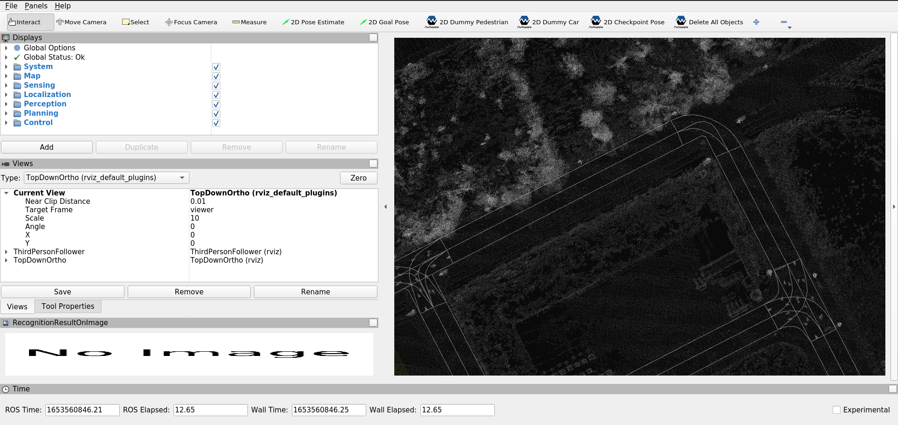
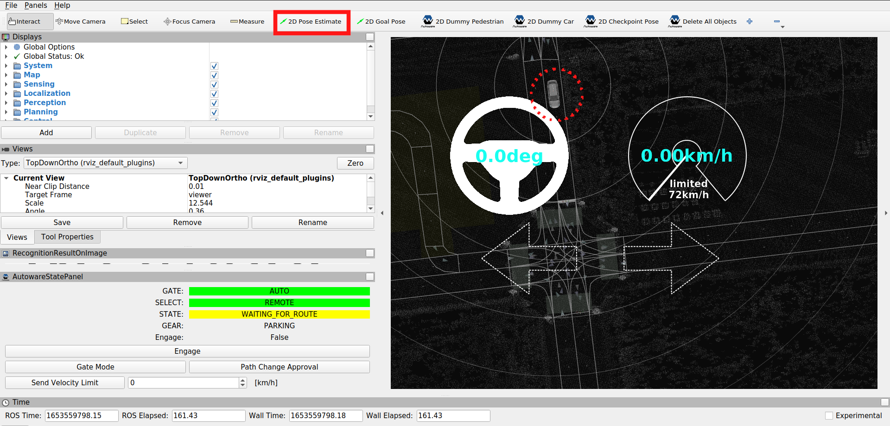
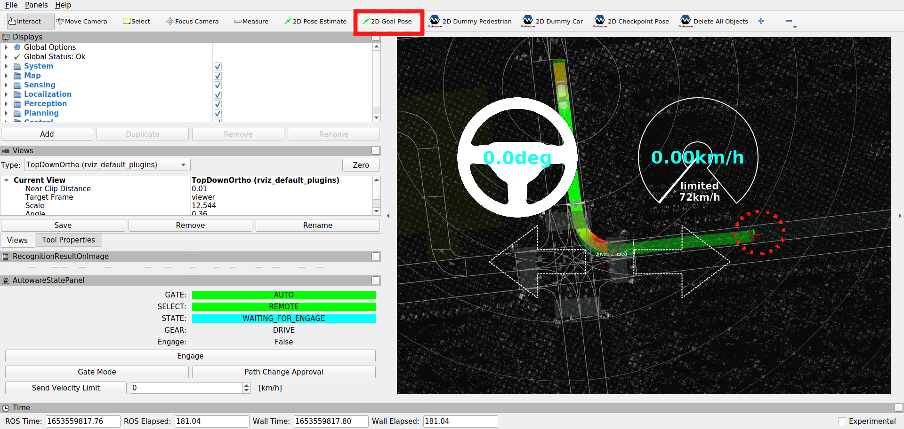
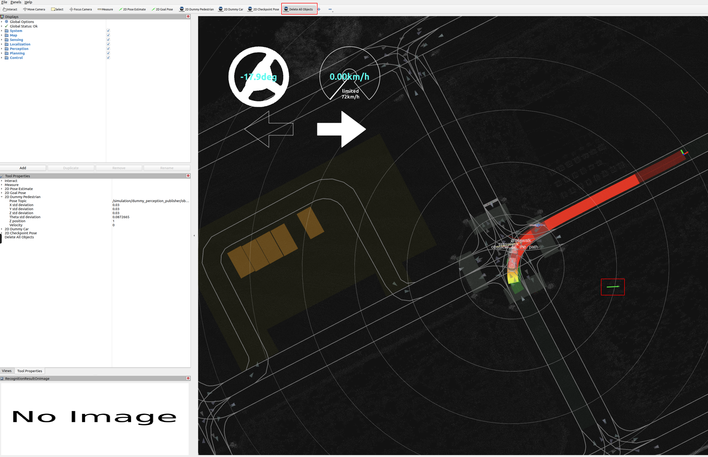
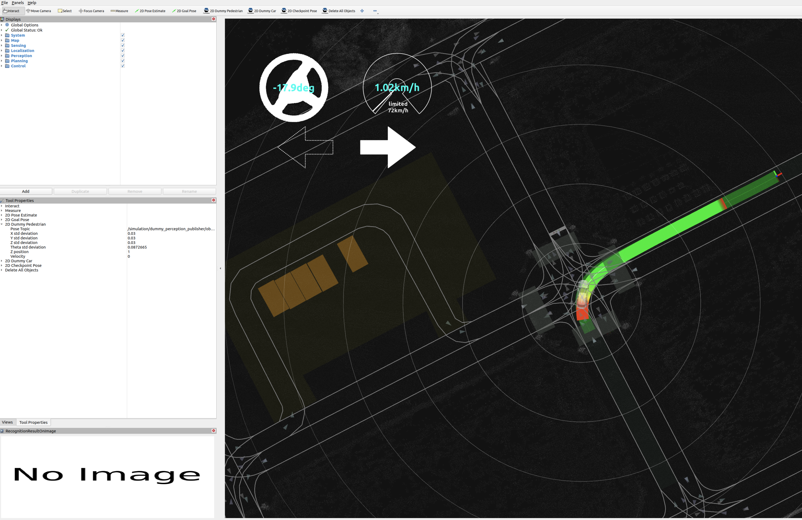
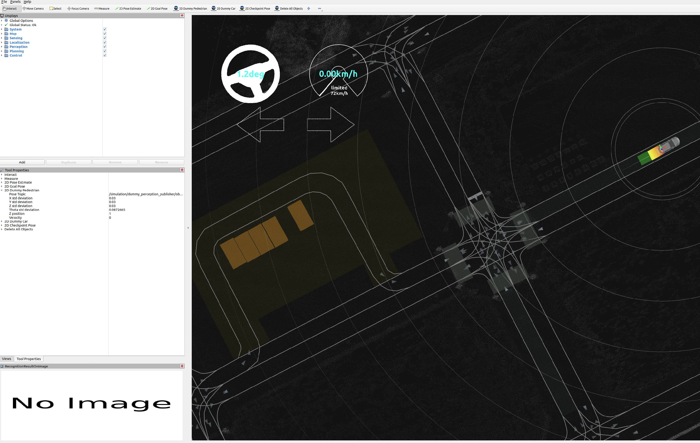
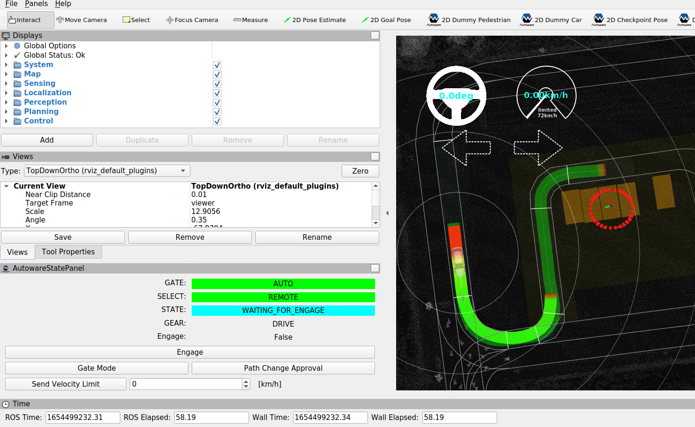
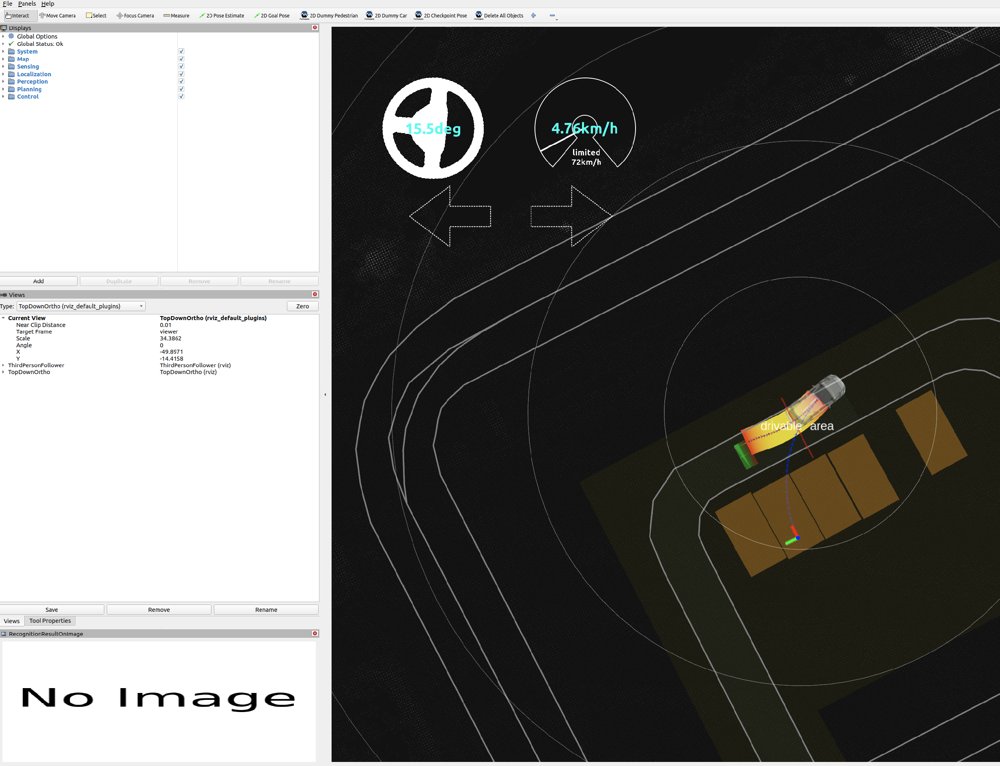
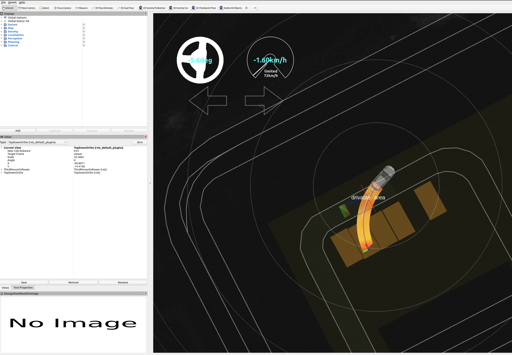
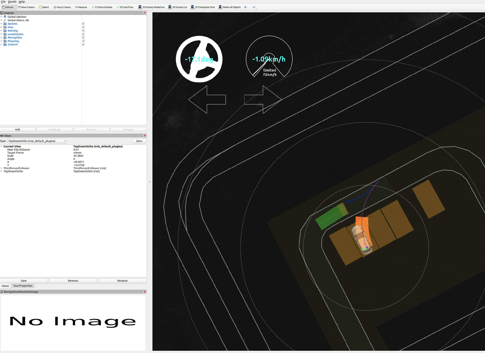

# Planning simulation

## Preparation

1. Download and unpack a sample map.

   <!--  TODO: Move to the AWF organization's Google Drive. -->

   - Click [here](https://drive.google.com/file/d/1zh_f9yKxTs6FsVHYVuF-tcBtbrDN5FZ8/view?usp=sharing) to download.
   - Unpack it by running the following command.

   ```bash
   unzip -d ~/Downloads/ ~/Downloads/sample-map-planning.zip
   ```

### Note

- Sample map: Copyright 2020 TIER IV, Inc.

## How to run a planning simulation

1. Launch Autoware.

   ```sh
   source ~/autoware/install/setup.bash
   ros2 launch autoware_launch planning_simulator.launch.xml map_path:=$HOME/Downloads/sample-map-planning vehicle_model:=sample_vehicle sensor_model:=sample_sensor_kit
   ```

   Note that you cannot use `~` instead of `$HOME` here.

   

2. Set an initial pose for the ego vehicle.

   - a) Click the `2D Pose estimate` button in the toolbar, or hit the `P` key
   - b) In the 3D View pane, click and hold the left-mouse button, and then drag to set the direction for the initial pose.

   

3. Set a goal pose for the ego vehicle.

   - a) Click the `2D Nav Goal` button in the toolbar, or hit the `G` key
   - b) In the 3D View pane, click and hold the left-mouse button, and then drag to set the direction for the goal pose.

   

4. To place a dummy object such as a pedestrian, click the `2D Dummy Pedestrian` button in the toolbar.

   

5. Engage the ego vehicle.

   ```bash
   ros2 topic pub /autoware/engage autoware_auto_vehicle_msgs/msg/Engage "engage: true" -1
   ```

   

6. To delete objects, click the `Delete All Objects` button in the toolbar.

   

7. After that, the vehicle will restart driving and reach the goal.

   

   

## How to simulate parking maneuvers

1. Set an initial pose and a goal pose, and engage the ego vehicle.

   

2. When the vehicle approaches the goal, it will change to the parking mode.

   

3. After that, the vehicle will start driving backwards and park at the destination parking spot.

   

   
