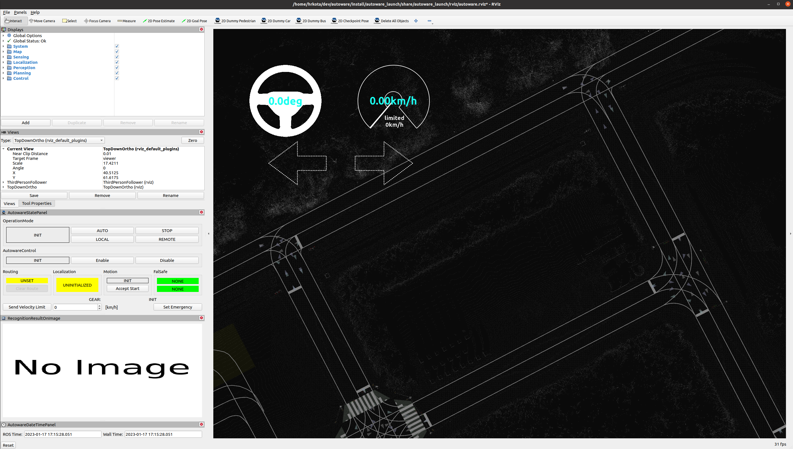
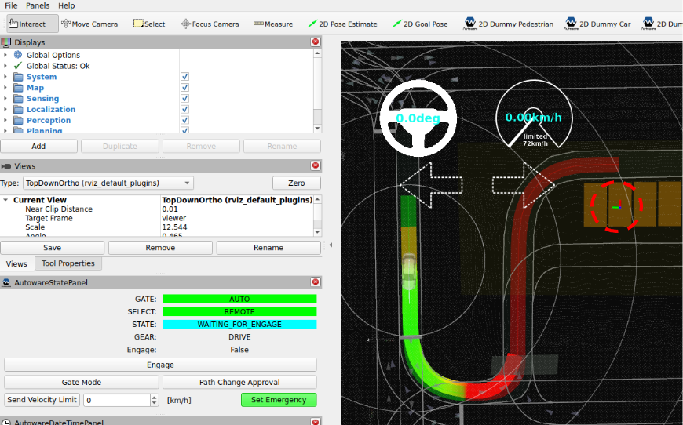

# Planning simulation

## Preparation

Download and unpack a sample map.

- Click [here](https://drive.google.com/file/d/1499_nsbUbIeturZaDj7jhUownh5fvXHd/view?usp=sharing) to download.
- Unpack it by running the following command.

```bash
unzip -d ~/Downloads/ ~/Downloads/sample-map-planning.zip
```

### Note

- Sample map: Copyright 2020 TIER IV, Inc.

## Basic Simulations

### Lane Driving

#### Launch Autoware

```sh
source ~/autoware/install/setup.bash
ros2 launch autoware_launch planning_simulator.launch.xml map_path:=$HOME/Downloads/sample-map-planning vehicle_model:=sample_vehicle sensor_model:=sample_sensor_kit
```

Note that you cannot use `~` instead of `$HOME` here.



#### Add Autoware State Panel

This panel is useful when running planning simulations. To add the panel, click `Panels -> Add new panel`, select `AutowareStatePanel`, and then click `OK`.


#### Set an initial pose for the ego vehicle


1. Click the `2D Pose estimate` button in the toolbar, or hit the `P` key.
2. In the 3D View pane, click and hold the left-mouse button, and then drag to set the direction for the initial pose. An image representing the vehicle should now be displayed.

!!! warning

    Remember to set the initial pose of the car in the same direction as the lane. To confirm the direction of the lane, check the arrowheads displayed on the map.

#### Set a goal pose for the ego vehicle

1. Click the `2D Goal Pose` button in the toolbar, or hit the `G` key.
2. In the 3D View pane, click and hold the left-mouse button, and then drag to set the direction for the goal pose.  If done correctly, you will see a planned path from initial pose to goal pose.


#### Engage the ego vehicle

Now you can start the ego vehicle driving by clicking the `Engage` button in `AutowareStatePanel`. Alteratively, you can manually engage the vehicle by running the following command:

```bash
source ~/autoware/install/setup.bash
ros2 topic pub /autoware/engage autoware_auto_vehicle_msgs/msg/Engage "engage: true" -1
```


### Parking maneuvers

1. Set an initial pose and a goal pose, and engage the ego vehicle.

   

2. When the vehicle approaches the goal, it will change to the parking mode.

   

3. After that, the vehicle will start driving backwards and park at the destination parking spot.

   

   

## Advanced Simulations

### Dummy objects

To place a dummy car/pedestrian, click the `2D Dummy Car` and/or `2D Dummy Pedestrian` button in the toolbar, and then set its pose by dragging on the map. You can set its velocity in `Tool Properties -> 2D Dummy Car/Pedestrian` panel. In the image the velocity is set to 0.


To delete any dummy objects placed in the view, click the `Delete All Objects` button in the toolbar.

### Traffic light simulation

To simulate traffic light recognition, go to `Panels -> Add new panel`, select `TrafficLightPublishPanel`, and then press `OK`. Then in the panel you need to set the `ID` and color of the traffic light.

You can find the `ID` of the desired traffic light by searching for the `traffic` tag in the `lanelet2_map.osm` file. The image below shows a traffic light whose `ID` is 34836 and its color is set to `RED`.


Finally, click the `PUBLISH` button to send the traffic light status to the simulator. Any planned path that goes past the selected traffic light will then change accordingly.


#### Reset traffic light (optinal)

If you previously set a traffic light to `RED` or `AMBER`, you can reset the color of the traffic light to `GREEN` and let the ego vehicle make a turn at the intersection.


