# Planning simulation

## Preparation

Download and unpack a sample map.

- You can also download [the map](https://drive.google.com/file/d/1499_nsbUbIeturZaDj7jhUownh5fvXHd/view?usp=sharing) manually.

```bash
gdown -O ~/autoware_map/ 'https://docs.google.com/uc?export=download&id=1499_nsbUbIeturZaDj7jhUownh5fvXHd'
unzip -d ~/autoware_map ~/autoware_map/sample-map-planning.zip
```

!!! Note

    Sample map: Copyright 2020 TIER IV, Inc.

Check if you have `~/autoware_data` folder and files in it.

```bash
$ cd ~/autoware_data
$ ls -C -w 30
image_projection_based_fusion
lidar_apollo_instance_segmentation
lidar_centerpoint
tensorrt_yolo
tensorrt_yolox
traffic_light_classifier
traffic_light_fine_detector
traffic_light_ssd_fine_detector
yabloc_pose_initializer
```

If not, please, follow [Manual dowloading of artifacts](https://github.com/autowarefoundation/autoware/tree/main/ansible/roles/artifacts).

## Basic simulations

### Lane driving scenario

#### 1. Launch Autoware

```bash
source ~/autoware/install/setup.bash
ros2 launch autoware_launch planning_simulator.launch.xml map_path:=$HOME/autoware_map/sample-map-planning vehicle_model:=sample_vehicle sensor_model:=sample_sensor_kit
```

!!! warning

    Note that you cannot use `~` instead of `$HOME` here.

    If `~` is used, the map will fail to load.


#### 2. Set an initial pose for the ego vehicle

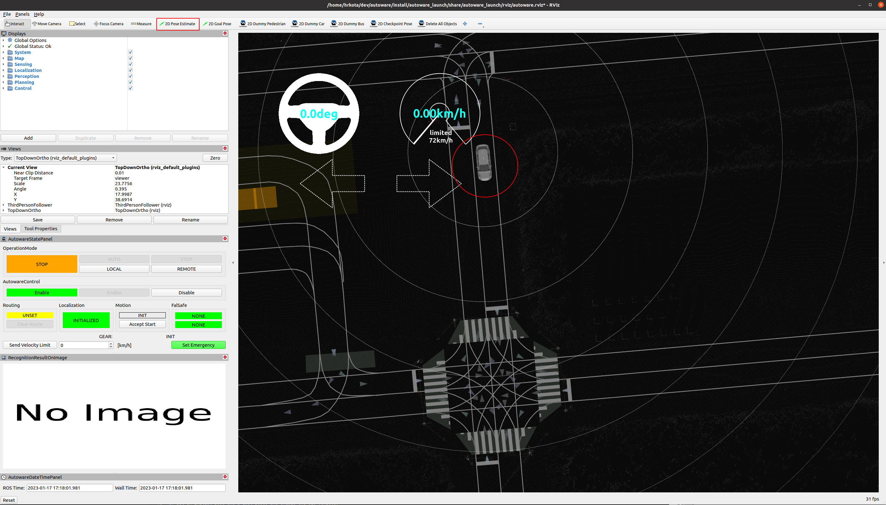

a) Click the `2D Pose estimate` button in the toolbar, or hit the `P` key.

b) In the 3D View pane, click and hold the left-mouse button, and then drag to set the direction for the initial pose. An image representing the vehicle should now be displayed.

!!! warning

    Remember to set the initial pose of the car in the same direction as the lane.

    To confirm the direction of the lane, check the arrowheads displayed on the map.

#### 3. Set a goal pose for the ego vehicle

a) Click the `2D Goal Pose` button in the toolbar, or hit the `G` key.

b) In the 3D View pane, click and hold the left-mouse button, and then drag to set the direction for the goal pose. If done correctly, you will see a planned path from initial pose to goal pose.


#### 4. Start the ego vehicle

Now you can start the ego vehicle driving by clicking the `AUTO` button on `OperationMode` in `AutowareStatePanel`.
Alteratively, you can manually start the vehicle by running the following command:

```bash
source ~/autoware/install/setup.bash
ros2 service call /api/operation_mode/change_to_autonomous autoware_adapi_v1_msgs/srv/ChangeOperationMode {}
```

After that, you can see `AUTONOMOUS` sign on `OperationMode` and `AUTO` button is grayed out.


### Parking scenario

1. Set an initial pose and a goal pose, and engage the ego vehicle.

   

2. When the vehicle approaches the goal, it will switch from lane driving mode to parking mode.
3. After that, the vehicle will reverse into the destination parking spot.

   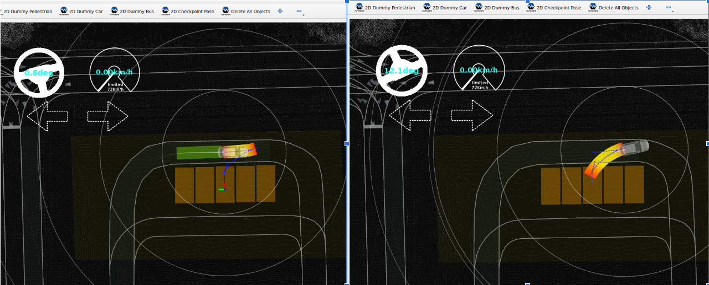

### Lane change scenario

1. Download and unpack Nishishinjuku map.

   ```bash
   gdown -O ~/autoware_map/ 'https://github.com/tier4/AWSIM/releases/download/v1.1.0/nishishinjuku_autoware_map.zip'
   unzip -d ~/autoware_map ~/autoware_map/nishishinjuku_autoware_map.zip
   ```

2. Launch autoware with Nishishinjuku map with following command:

   ```bash
   source ~/autoware/install/setup.bash
   ros2 launch autoware_launch planning_simulator.launch.xml map_path:=$HOME/autoware_map/nishishinjuku_autoware_map vehicle_model:=sample_vehicle sensor_model:=sample_sensor_kit
   ```

   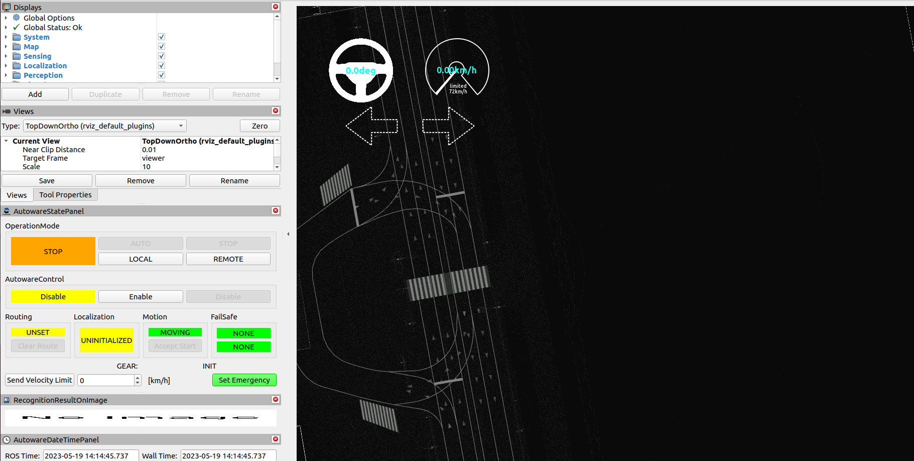

3. Set an initial pose and a goal pose in adjacent lanes.

   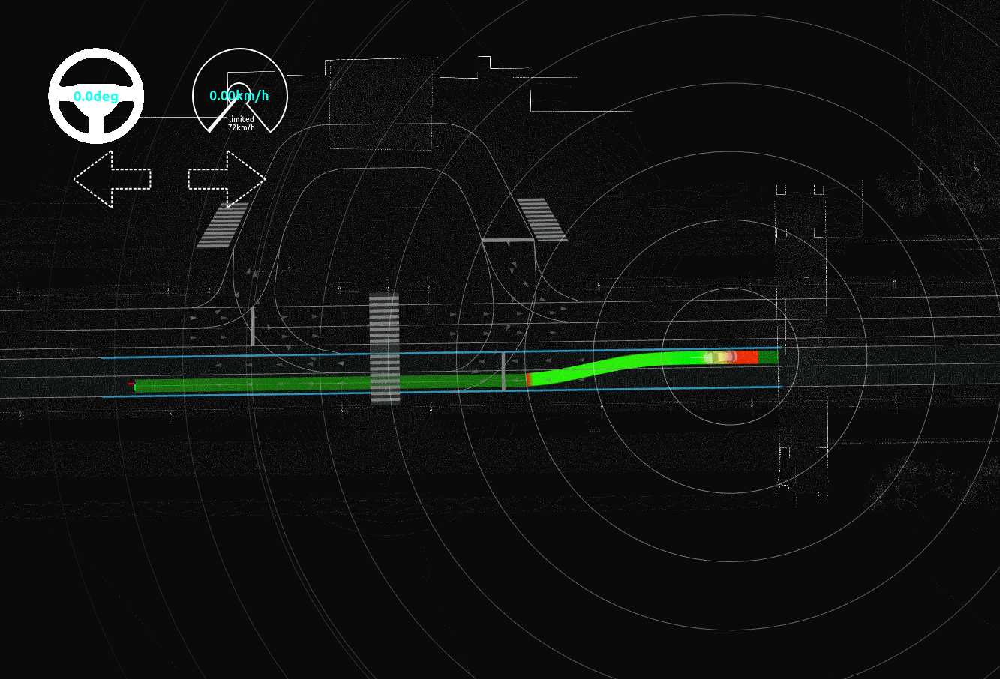

4. Engage the ego vehicle. It will make a lane change along the planned path.

   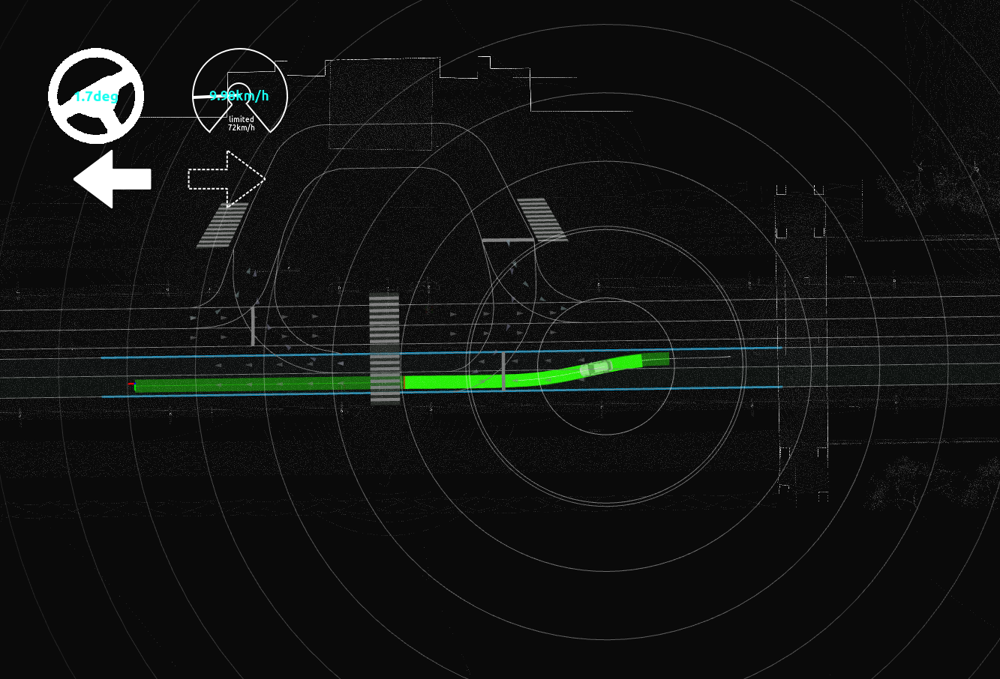

### Avoidance scenario

1. Set an initial pose and a goal pose in the same lane. A path will be planned.

   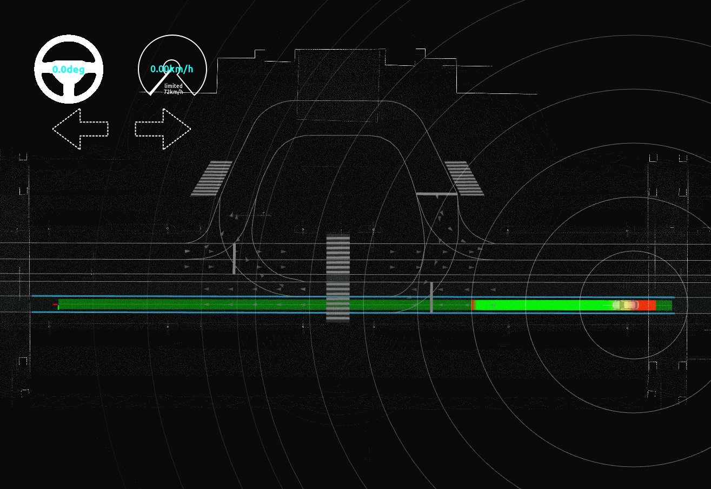

2. Set a "2D Dummy Bus" on the roadside. A new path will be planned.

   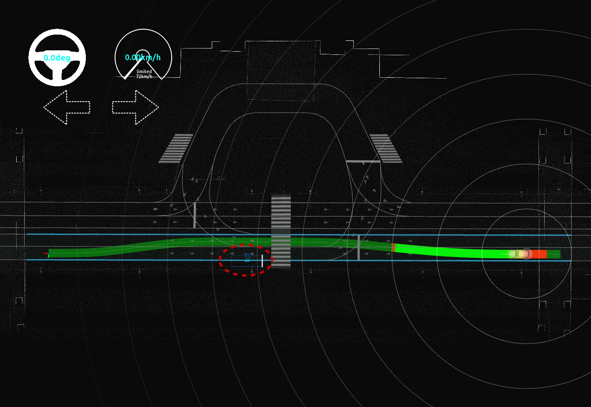

3. Engage the ego vehicle. It will avoid the obstacle along the newly planned path.

## Advanced Simulations

### Placing dummy objects

1. Click the `2D Dummy Car` or `2D Dummy Pedestrian` button in the toolbar.
2. Set the pose of the dummy object by clicking and dragging on the map.
3. Set the velocity of the object in `Tool Properties -> 2D Dummy Car/Pedestrian` panel.

   !!! note

   Changes to the `velocity` parameter will only affect objects placed after the parameter is changed.

   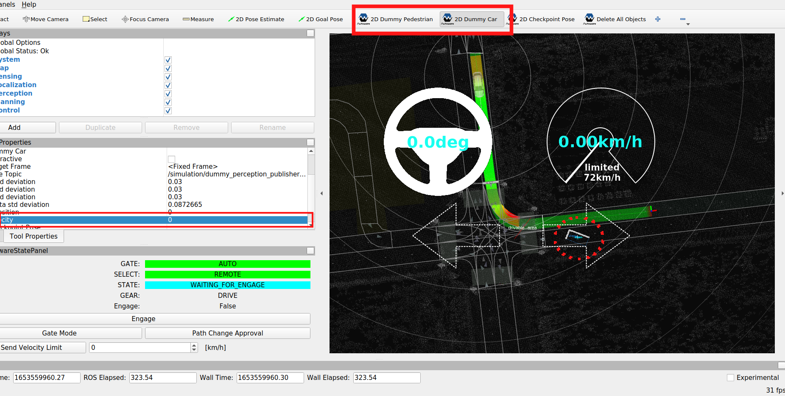

4. Delete any dummy objects placed in the view by clicking the `Delete All Objects` button in the toolbar.

5. Click the `Interactive` button in the toolbar to make the dummy object interactive.

   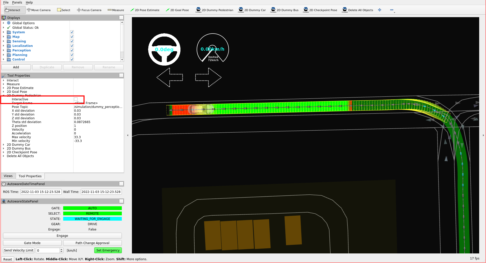

6. For adding an interactive dummy object, press `SHIFT` and click the `right click`.
7. For deleting an interactive dummy object, press `ALT` and click the `right click`.
8. For moving an interactive dummy object, hold the `right click` drag and drop the object.

   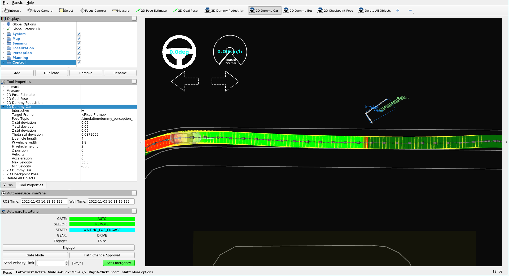

### Traffic light recognition simulation

By default, traffic lights on the map are all treated as if they are set to green. As a result, when a path is created that passed through an intersection with a traffic light, the ego vehicle will drive through the intersection without stopping.

The following steps explain how to set and reset traffic lights in order to test how the Planning component will respond.

#### Set traffic light

1. Go to `Panels -> Add new panel`, select `TrafficLightPublishPanel`, and then press `OK`.

2. In `TrafficLightPublishPanel`, set the `ID` and color of the traffic light.

3. Click the `SET` button.
   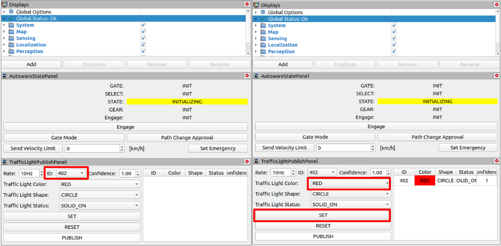

4. Finally, click the `PUBLISH` button to send the traffic light status to the simulator. Any planned path that goes past the selected traffic light will then change accordingly.

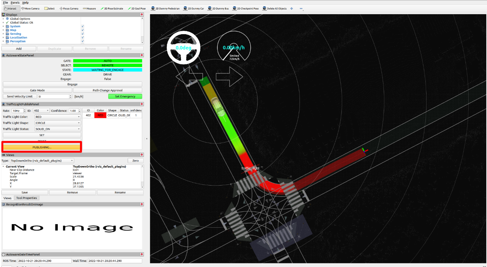

By default, Rviz should display the ID of each traffic light on the map. You can have a closer look at the IDs by zooming in the region or by changing the View type.

In case the IDs are not displayed, try the following troubleshooting steps:

a) In the `Displays` panel, find the `traffic_light_id` topic by toggling the triangle icons next to `Map > Lanelet2VectorMap > Namespaces`.

b) Check the `traffic_light_id` checkbox.

c) Reload the topic by clicking the `Map` checkbox twice.


#### Update/Reset traffic light

You can update the color of the traffic light by selecting the next color (in the image it is `GREEN`) and clicking `SET` button. In the image the traffic light in front of the ego vehicle changed from `RED` to `GREEN` and the vehicle restarted.

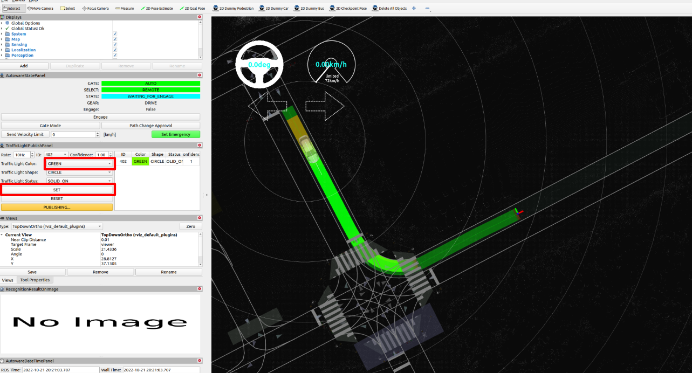

To remove a traffic light from `TrafficLightPublishPanel`, click the `RESET` button.

[Reference video tutorials](https://drive.google.com/file/d/1bs_dX1JJ76qHk-SGvS6YF9gmekkN8fz7/view?usp=sharing)
