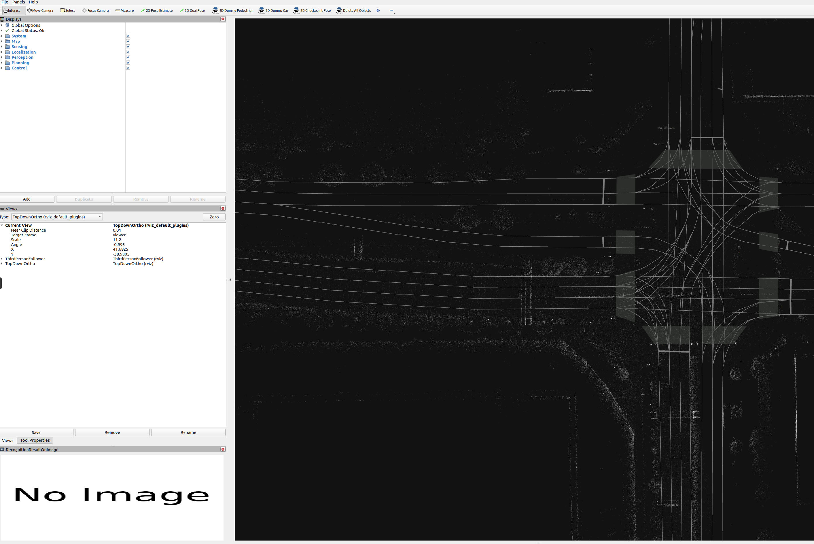
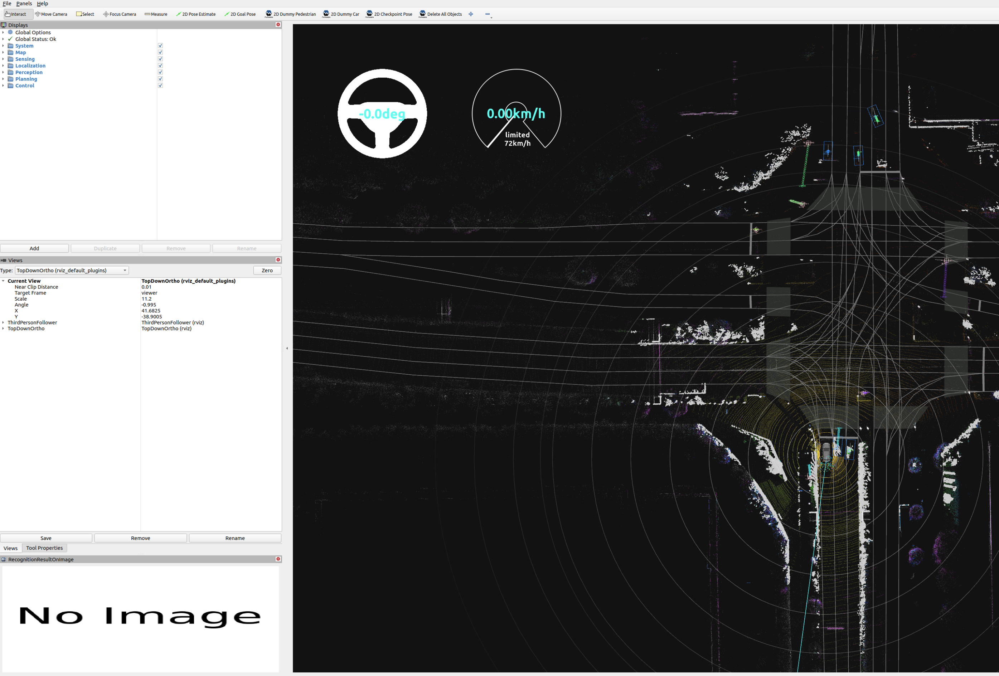
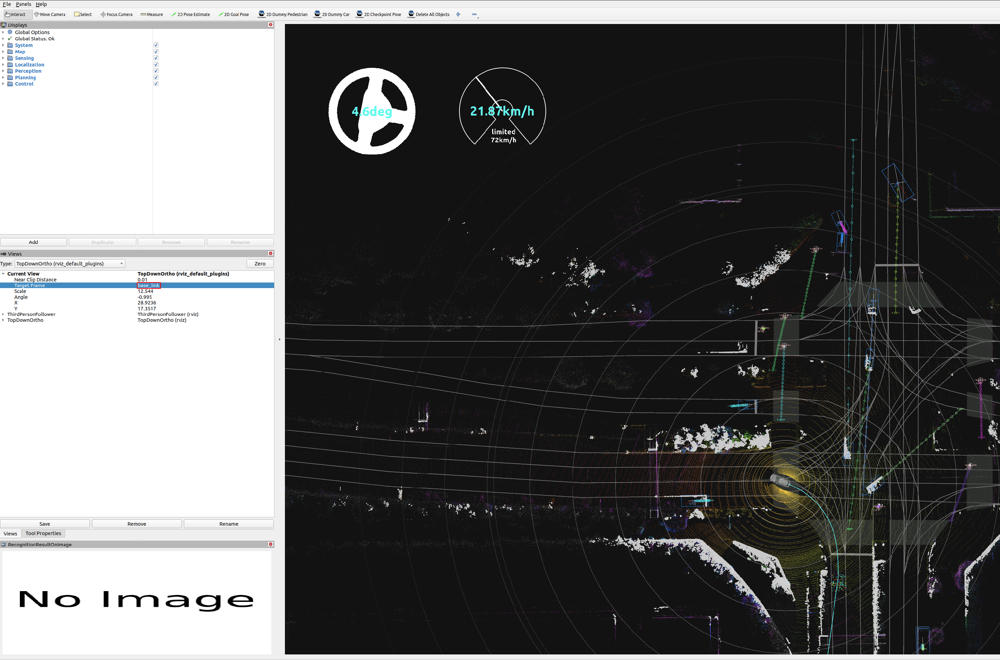
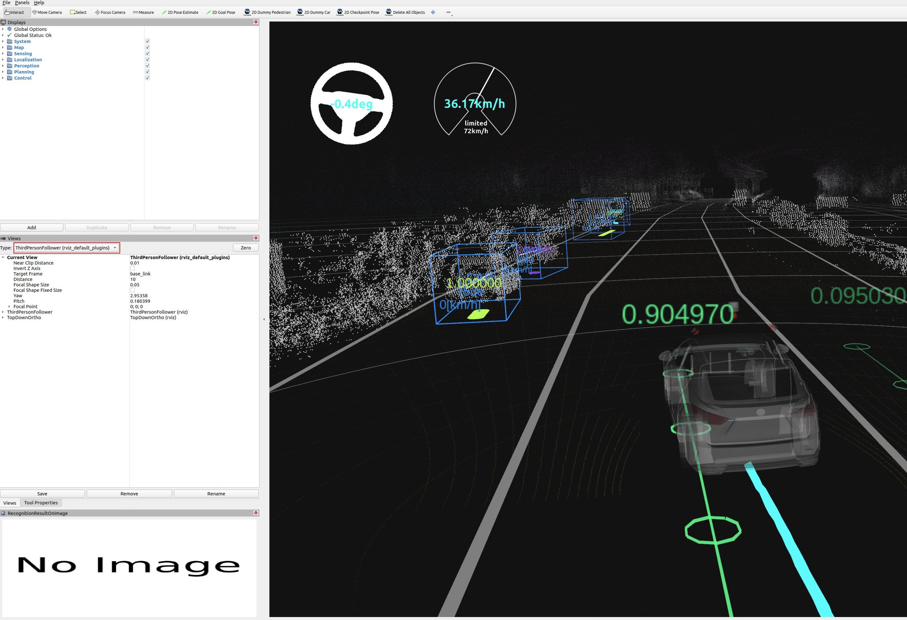

# Rosbag replay simulation

## Steps

1. Download and unpack a sample map.

   <!--  TODO: Move to the AWF organization's Google Drive. -->

   - Click [here](https://drive.google.com/file/d/14EAKHSldOjJmHHEi6bVpT4bLFVmavLkl/view?usp=sharing) to download.
   - Unpack it by running the following command.

   ```bash
   unzip -d ~/Downloads/ ~/Downloads/sample-map-rosbag.zip
   ```

2. Download the sample rosbag files.

   <!--  TODO: Move to the AWF organization's Google Drive. -->

   - Click [here](https://drive.google.com/file/d/151YTzZzRzEH7uxHIQ1JhHlWNazCQvEZ8/view?usp=sharing) to download.
   - Unpack it by running the following command.

   ```bash
   unzip -d ~/Downloads/ ~/Downloads/sample-rosbag.zip
   ```

### Note

- Sample map and rosbag: Copyright 2020 TIER IV, Inc.
- Due to privacy concerns, the rosbag does not contain image data, which will cause:
  - Traffic light recognition functionality cannot be tested with this sample rosbag.
  - Object detection accuracy is decreased.

## How to run a rosbag replay simulation

1. Launch Autoware.

   ```sh
   source ~/autoware/install/setup.bash
   ros2 launch autoware_launch logging_simulator.launch.xml map_path:=$HOME/Downloads/sample-map-rosbag vehicle_model:=sample_vehicle sensor_model:=sample_sensor_kit
   ```

   Note that you cannot use `~` instead of `$HOME` here.

   

2. Play the sample rosbag file.

   ```sh
   source ~/autoware/install/setup.bash
   ros2 bag play ~/Downloads/sample-rosbag/sample.db3 -r 0.2
   ```

   

3. To focus the view on the ego vehicle, change the `Target Frame` in the RViz Views panel from `viewer` to `base_link`.

   

4. To switch the view to `Third Person Follower` etc, change the `Type` in the RViz Views panel.

   
