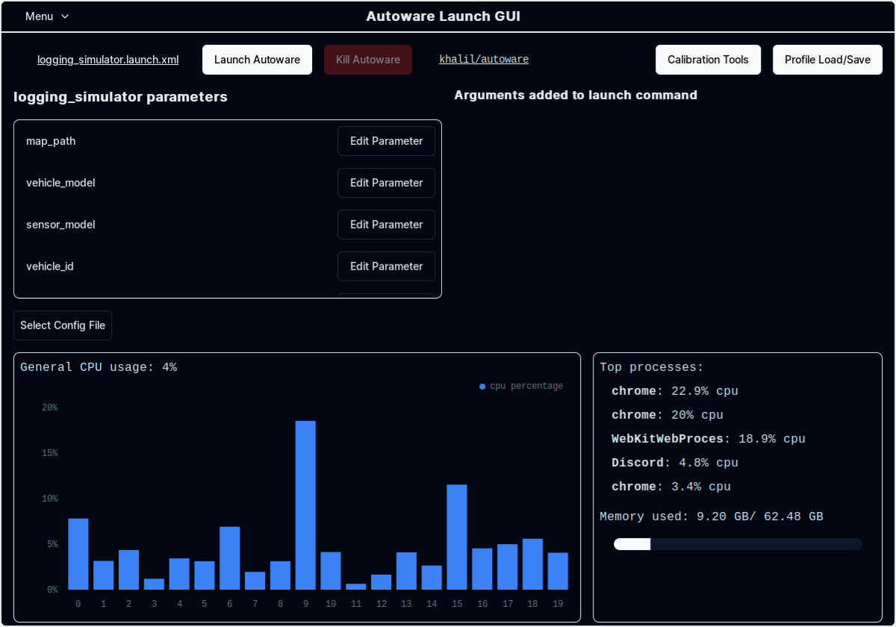
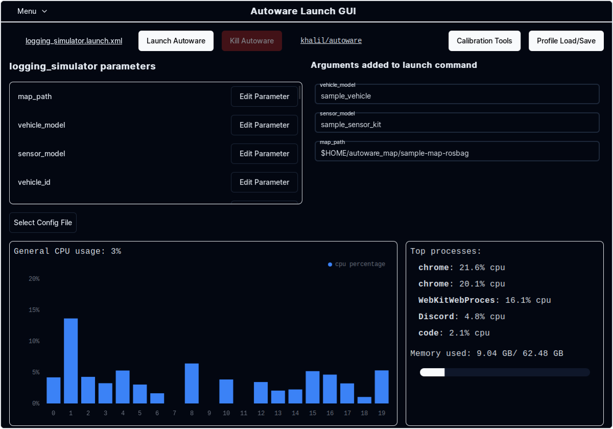
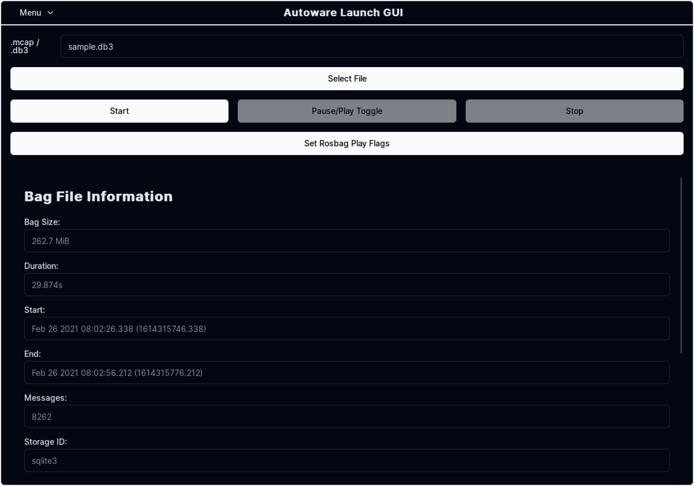
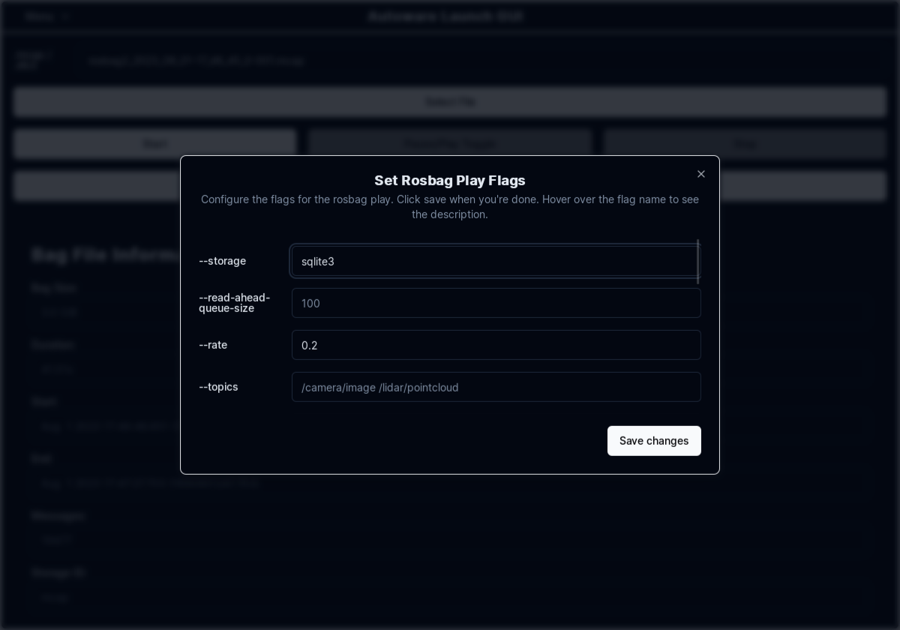

# Rosbag replay simulation

## Steps

1. Download and unpack a sample map.

   - You can also download [the map](https://drive.google.com/file/d/1A-8BvYRX3DhSzkAnOcGWFw5T30xTlwZI/view?usp=sharing) manually.

   ```bash
   gdown -O ~/autoware_map/ 'https://docs.google.com/uc?export=download&id=1A-8BvYRX3DhSzkAnOcGWFw5T30xTlwZI'
   unzip -d ~/autoware_map/ ~/autoware_map/sample-map-rosbag.zip
   ```

2. Download the sample rosbag files.

   - You can also download [the rosbag files](https://drive.google.com/file/d/1sU5wbxlXAfHIksuHjP3PyI2UVED8lZkP/view?usp=sharing) manually.

   ```bash
   gdown -O ~/autoware_map/ 'https://docs.google.com/uc?export=download&id=1sU5wbxlXAfHIksuHjP3PyI2UVED8lZkP'
   unzip -d ~/autoware_map/ ~/autoware_map/sample-rosbag.zip
   ```

3. Check if you have `~/autoware_data` folder and files in it.

   ```bash
   $ cd ~/autoware_data
   $ ls -C -w 30
   image_projection_based_fusion
   lidar_apollo_instance_segmentation
   lidar_centerpoint
   tensorrt_yolo
   tensorrt_yolox
   traffic_light_classifier
   traffic_light_fine_detector
   traffic_light_ssd_fine_detector
   yabloc_pose_initializer
   ```

   If not, please, follow [Manual downloading of artifacts](https://github.com/autowarefoundation/autoware/tree/main/ansible/roles/artifacts).

### Note

- Sample map and rosbag: Copyright 2020 TIER IV, Inc.
- Due to privacy concerns, the rosbag does not contain image data, which will cause:
  - Traffic light recognition functionality cannot be tested with this sample rosbag.
  - Object detection accuracy is decreased.

## How to run a rosbag replay simulation

!!! info "[Using Autoware Launch GUI](#using-autoware-launch-gui)"

    If you prefer a graphical user interface (GUI) over the command line for launching and managing your simulations, refer to the `Using Autoware Launch GUI` section at the end of this document for a step-by-step guide.

1. Launch Autoware.

   ```sh
   source ~/autoware/install/setup.bash
   ros2 launch autoware_launch logging_simulator.launch.xml map_path:=$HOME/autoware_map/sample-map-rosbag vehicle_model:=sample_vehicle sensor_model:=sample_sensor_kit
   ```

   Note that you cannot use `~` instead of `$HOME` here.

   

   > ⚠️ You might encounter error and warning messages in the terminal before playing the `rosbag`. This is normal behavior. These should cease once the `rosbag` is played and proper initialization takes place

2. Play the sample rosbag file.

   ```sh
   source ~/autoware/install/setup.bash
   ros2 bag play ~/autoware_map/sample-rosbag/ -r 0.2 -s sqlite3
   ```

   > ⚠️ Due to the discrepancy between the timestamp in the `rosbag` and the current system timestamp, Autoware may generate warning messages in the terminal alerting to this mismatch. This is normal behavior.

   

3. To focus the view on the ego vehicle, change the `Target Frame` in the RViz Views panel from `viewer` to `base_link`.

   

4. To switch the view to `Third Person Follower` etc, change the `Type` in the RViz Views panel.

   

[Reference video tutorials](https://drive.google.com/file/d/12D6aSC1Y3Kf7STtEPWG5RYynxKdVcPrc/view?usp=sharing)

## Using Autoware Launch GUI

This section provides a step-by-step guide for using the Autoware Launch GUI to launch and manage your rosbag replay simulation. offering an alternative to the command-line instructions provided in the previous section.

### Getting Started with Autoware Launch GUI

1. **Installation:** Ensure you have installed the Autoware Launch GUI. [Installation instructions](https://github.com/autowarefoundation/autoware-launch-gui#installation).

2. **Launching the GUI:** Open the Autoware Launch GUI from your applications menu.
   

### Launching a Logging Simulation

1. **Set Autoware Path:** In the GUI, set the path to your Autoware installation.
   
2. **Select Launch File:** Choose `logging_simulator.launch.xml` for the lane driving scenario.
   
3. **Customize Parameters:** Adjust parameters such as `map_path`, `vehicle_model`, and `sensor_model` as needed.

   
   

4. **Start Simulation:** Click the launch button to start the simulation and have access to all the logs.

   

5. **Play Rosbag:** Move to the `Rosbag` tab and select the rosbag file you wish to play.

   

6. **Adjust Playback Speed:** Adjust the playback speed as needed and any other parameters you wish to customize.

   

7. **Start Playback:** Click the play button to start the rosbag playback and have access to settings such as `pause/play`, `stop`, and `speed slider`5.

   

8. **View Simulation:** Move to the `RViz` window to view the simulation.

   

9. To focus the view on the ego vehicle, change the `Target Frame` in the RViz Views panel from `viewer` to `base_link`.

   

10. To switch the view to `Third Person Follower` etc, change the `Type` in the RViz Views panel.

    
