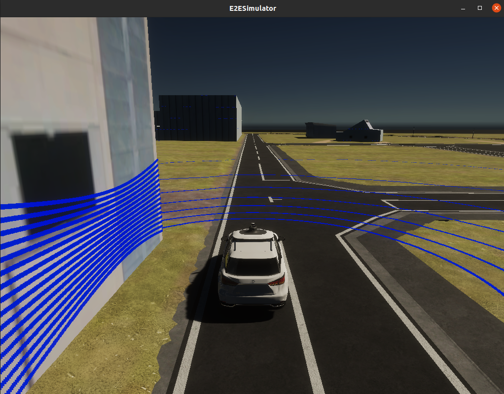

# AWSIM simulator setup

## Preparation

- Install Autoware following the [official guide](https://autowarefoundation.github.io/autoware-documentation/main/installation/autoware/source-installation/)
- Download and extract the [AWSIM binary](https://drive.google.com/file/d/1jgB_A5cSso9dzcNffQYthe07GG07QLQh/view?usp=sharing)
- Download and extract the [sample map folder](https://drive.google.com/file/d/1vGFI0o0zQ-gRZYqKrPbnrtCN3c3-92Fy/view?usp=sharing)

## Running steps

### AWSIM Simulator

To run the AWSIM simulator, open a terminal window, navigate to the simulation directory and run:

```console
source /opt/ros/galactic/setup.bash
cd <PATH_TO_EXTRACTED_FOLDER_WITH_AWSIM>
./AWSIM.x86_64

The properly working simulator should have the lidar rays visible and the data topics should appear when discovering using `ros2 topic list`.



#### Simulator shortcuts

It is possible to adjust/control the simulation through the shortcuts listed below:

- v - turn on/off lidar points visualization
- m - enter/exit manual operation mode (Ego listens to keyboard)
  - In manual mode:
    - d - drive
    - p - parking brake
    - r - reverse
    - arrows - acceleration and steering
    - lights:
      - 1 - left blinker
      - 2- right blinker
      - 3 - emergency lights
      - 4- turning the lights off

### Autoware

To run the Autoware, please:

- open the terminal and go to Autoware directory

        cd <YOUR_WORKSPACE>/autoware

- source the installation and run the solution

        source install/setup.bash
        ros2 launch autoware_launch autoware.launch.xml map_path:=<PATH_TO_EXTRACTED_FOLDER_WITH_MAP> vehicle_model:=sample_vehicle sensor_model:=sample_sensor_kit use_sim_time:=true launch_sensing_driver:=false

_NOTE: The map_path has to start with /home/... , relative path will not work properly_

- the RViZ with the map should appear. The ego can localize itself at the beginning however the localization can be inaccurate. It is advised to place the `2D Pose Estimate` marker as shown on the image below.


- to make the Autoware plan the route please place the `2D Goal Pose` marker somewhere within the lanelet2 road lanes. _NOTE: The plan can be not visible due to problem with plan visualization plugin which was omitted during the Autoware build process_

- To make Autoware execute the planned route, open a new terminal and send the engage message:

        cd <YOUR_WORKSPACE>/autoware
        source install/setup.bash
        ros2 topic pub /autoware/engage autoware_auto_vehicle_msgs/msg/Engage "engage: true"

From now on the Autoware will execute the path and operate the AWSIM Simulator.


### NPC Control (optional)

Currently the only supported way to add NPCs to the simulation is using prerecorded rosbags.

#### Preparation

- Download and extract npc_msgs : [link](https://drive.google.com/file/d/1fMvjOnz7Z0cGXotwdOAhBfLPYO52ssp0/view?usp=sharing)
- Download and extract sample rosbags : [link](to be filled)

#### Run NPCs from rosbag

To run NPCs from rosbag, follow the steps:

- navigate to the directory with extracted npc_msgs
- build and source npc_msgs:

        colcon build
        source install/setup.bash

- play sample rosbag while AWSIM is running:

        ros2 bag play <ROSBAG_NAME>

### Troubleshooting

If the data on topics is not produced or the poincloud is not visible on the simulation screen please find a `Player.log` file and provide it to the simulation suppliers (the file can be found under `~/.config/unity3d/Tier\ IV/E2ESimulator` directory).
