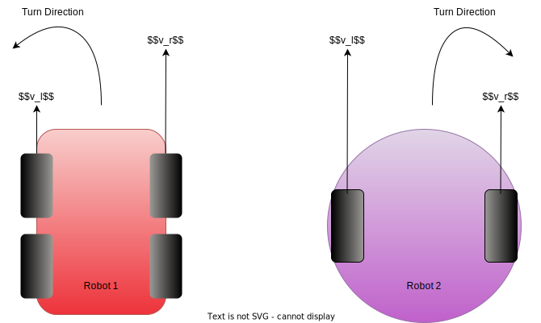

# Customizing for differential drive vehicle

## 1. Introduction

Currently, Autoware assumes that vehicles use an Ackermann kinematic model with Ackermann steering.
Thus, Autoware adopts the Ackermann command format for the Control module's output
(see [the AckermannDrive ROS message definition](http://docs.ros.org/en/api/ackermann_msgs/html/msg/AckermannDrive.html) for an overview of Ackermann commands,
and [the AckermannControlCommands struct](https://gitlab.com/autowarefoundation/autoware.auto/autoware_auto_msgs/-/blob/master/autoware_auto_control_msgs/msg/AckermannControlCommand.idl)
used in Autoware for more details).

However,
it is possible to integrate Autoware with a vehicle
that follows a differential drive kinematic model,
as commonly used by small mobile robots.
The differential vehicles can be either four-wheel or two-wheel, as described in the figure below.

<figure markdown>
  { align=center }
  <figcaption>
    Sample differential vehicles with four-wheel and two-wheel models.
  </figcaption>
</figure>

## 2. Procedure

One simple way of using Autoware with a differential drive vehicle is to create a `vehicle_interface` package that translates Ackermann commands to differential drive commands.
Here are two points that you need to consider:

- Create `vehicle_interface` package for differential drive vehicle
- Set an appropriate `wheel_base`

### 2.1 Create a `vehicle_interface` package for differential drive vehicle

An Ackermann command in Autoware consists of two main control inputs:

- steering angle ($\omega$)
- velocity ($v$)

Conversely, a typical differential drive command consists of the following inputs:

- left wheel velocity ($v_l$)
- right wheel velocity ($v_r$)

So, one way in which an Ackermann command can be converted to a differential drive command is by using the following equations:

$$
v_l = v - \frac{l\omega}{2},
v_r = v + \frac{l\omega}{2}
$$

where $l$ denotes wheel tread.

Here is the example `.cpp` snippet
for converting ackermann model kinematics to a differential model:

```c++
...
void convert_ackermann_to_differential(
  autoware_auto_control_msgs::msg::AckermannControlCommand & ackermann_msg
  my_vehicle_msgs::msg::DifferentialCommand & differential_command)
{
    differential_command.left_wheel.velocity =
      ackermann_msg.longitudinal.speed - (ackermann_msg.lateral.steering_tire_angle * my_wheel_tread) / 2;
    differential_command.right_wheel.velocity =
      ackermann_msg.longitudinal.speed + (ackermann_msg.lateral.steering_tire_angle * my_wheel_tread) / 2;
}
...
```

For information about other factors
that need to be considered when creating a `vehicle_interface` package,
refer to the [creating `vehicle_interface` page](./creating-vehicle-interface.md).

### 2.2 Set an appropriate `wheel_base`

A differential drive robot does not necessarily have front and rear wheels, which means that the wheelbase (the horizontal distance between the axles of the front and rear wheels) cannot be defined. However, Autoware expects `wheel_base` to be set in `vehicle_info.param.yaml` with some value.
Thus, you need to set a pseudo value for `wheel_base`.

The appropriate pseudo value for `wheel_base` depends on the size of your vehicle.
Setting it to be the same value as `wheel_tread` is one possible choice.

!!! warning

    - If the `wheel_base` value is set too small then the vehicle may behave unexpectedly. For example, the vehicle may drive beyond the bounds of a calculated path.
    - Conversely, if `wheel_base` is set too large, the vehicle's range of motion will be restricted. The reason being that Autoware's Planning module will calculate an overly conservative trajectory based on the assumed vehicle length.

## 3. Known issues

### Motion model incompatibility

Since Autoware assumes that vehicles use a steering system, it is not possible to take advantage of the flexibility of a differential drive system's motion model.

For example, when planning a parking maneuver with the `freespace_planner` module, Autoware may drive the differential drive vehicle forward and backward, even if the vehicle can be parked with a simpler trajectory that uses pure rotational movement.
