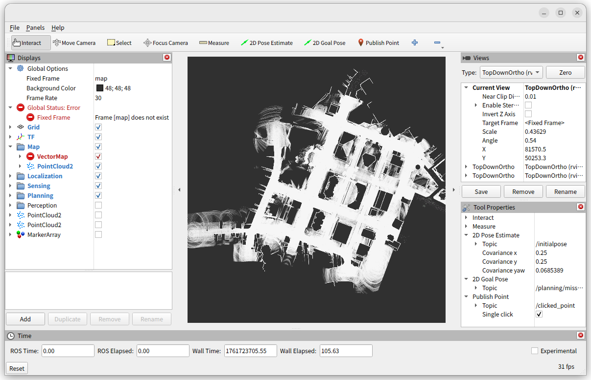
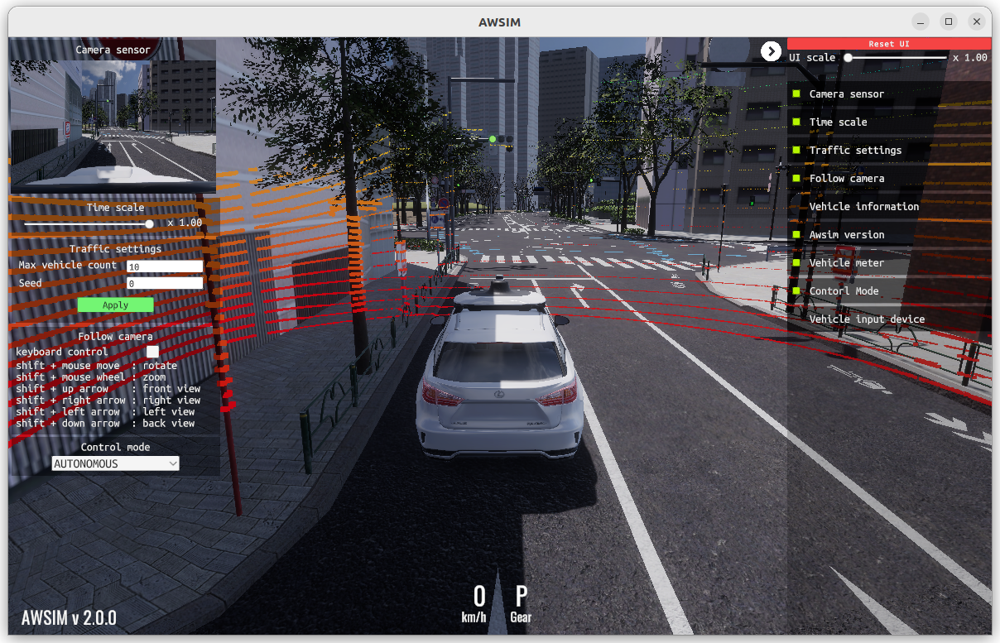

# Autoware Core digital twin simulation with AWSIM

## Download AWSIM

1. Download following files from [this page](https://tier4.github.io/AWSIM/Downloads/).
   - AWSIM-Demo.zip
   - Shinjuku-Map.zip

2. Extract the downloaded files. This page assumes the files are placed in the following paths.
   - $HOME/Downloads/AWSIM-Demo
   - $HOME/Downloads/Shinjuku-Map

## Start simulation

1. Launch Autoware according to the section below depending on your installation type.
   - Launch Autoware for Docker installation
   - Launch Autoware for source installation
   - Launch Autoware for Debian Package installation

   The map will be displayed in Rviz as shown below.
   

2. Launch AWSIM.

   ```bash
   cd $HOME/Downloads/AWSIM-Demo
   ./AWSIM-Demo.x86_64
   ```

   The AWSIM will be displayed as shown below.
   

3. Initialize pose. Select "2D Pose Estimate" and drag the mouse as shown by the arrow.

   

4. Set goal pose. Select "2D Goal Pose" and drag the mouse as shown by the arrow.

   

5. Start autonomous driving.

   ```bash
   source $HOME/autoware_launch_workspace/install/setup.bash
   ros2 topic pub /system/operation_mode/state autoware_adapi_v1_msgs/msg/OperationModeState "{mode: 2, is_autoware_control_enabled: true, is_autonomous_mode_available: true}" --once
   ros2 topic pub /control/command/gear_cmd autoware_vehicle_msgs/msg/GearCommand "command: 2" --once
   ```

## Launch Autoware for Docker installation

!!! warning

    Under Construction. It cannot be executed because the description package has not been released yet,

## Launch Autoware for source installation

- Same as "Launch Autoware for Debian Package installation" section except:
  - In step 4, source `$HOME/autoware_core_workspace/install/setup.bash` instead of `/opt/ros/humble/setup.bash`.

## Launch Autoware for Debian Package installation

1. Create launch workspace and clone repository into it.

   ```bash
   mkdir -p $HOME/autoware_launch_workspace/tmp
   cd $HOME/autoware_launch_workspace/tmp
   git clone https://github.com/autowarefoundation/autoware_launch.git
   git clone https://github.com/tier4/sensor_component_description.git
   ```

2. Remove unnecessary packages.

   ```bash
   cd $HOME/autoware_launch_workspace
   mkdir src
   colcon list --paths-only --packages-up-to sample_vehicle_description awsim_sensor_kit_description | xargs -I{} mv {} src
   rm -rf tmp
   ```

3. Install dependent ROS packages.

   ```bash
   cd $HOME/autoware_launch_workspace
   sudo apt update
   sudo apt -y install ros-humble-topic-tools
   rosdep update
   rosdep install -y --from-paths src --ignore-src --rosdistro humble
   ```

4. Build the workspace.

   ```bash
   cd $HOME/autoware_launch_workspace
   source /opt/ros/humble/setup.bash
   colcon build --symlink-install
   ```

5. Launch Autoware.

   ```bash
   cd $HOME/autoware_launch_workspace
   source install/setup.bash
   ros2 launch autoware_core autoware_core.launch.xml use_sim_time:=true map_path:=$HOME/Downloads/Shinjuku-Map/map vehicle_model:=sample_vehicle sensor_model:=awsim_sensor_kit
   ```
