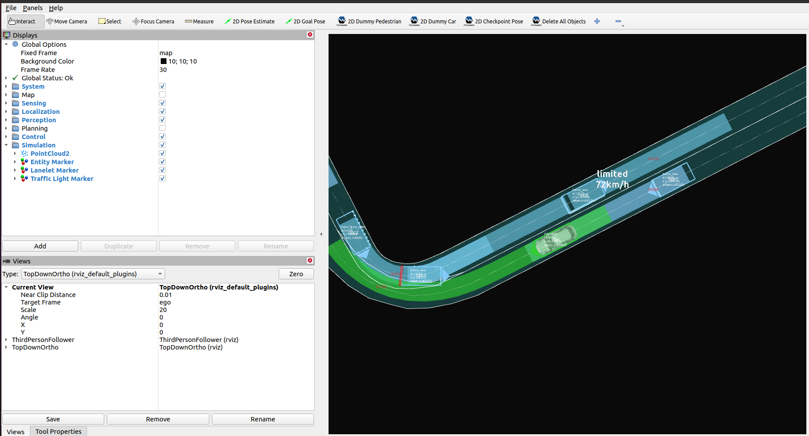

# Random test simulation

!!! note

    Running the Scenario Simulator requires some additional steps on top of building and installing Autoware, so make sure that [Scenario Simulator installation](installation.md) has been completed first before proceeding.

## Running steps

1. Move to the workspace directory where Autoware and the Scenario Simulator have been built.

2. Source the workspace setup script

   ```bash
   source install/setup.bash
   ```

3. Run

   ```bash
   ros2 launch random_test_runner random_test.launch.py \
   architecture_type:=awf/universe \
   sensor_model:=sample_sensor_kit \
   vehicle_model:=sample_vehicle
   ```



For more information about supported parameters, refer to the ![random_test_runner documentation].(<https://github.com/tier4/scenario_simulator_v2/blob/master/test_runner/random_test_runner/Readme.md#node-parameters>)
