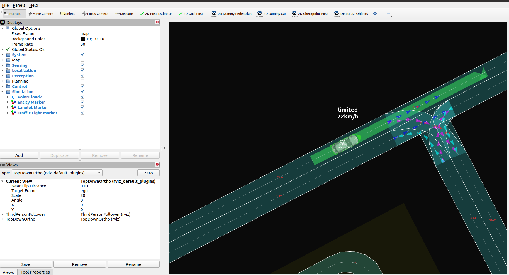

# Scenario test simulation

!!! note

    Running the Scenario Simulator requires some additional steps on top of building and installing Autoware, so make sure that [Scenario Simulator installation](installation.md) has been completed first before proceeding.

## Running steps

1. Move to the workspace directory where Autoware and the Scenario Simulator have been built.

2. Source the workspace setup script

   ```bash
   source install/setup.bash
   ```

3. Run

   ```bash
   ros2 launch scenario_test_runner scenario_test_runner.launch.py \
   architecture_type:=awf/universe \
   record:=false \
   scenario:='$(find-pkg-share scenario_test_runner)/scenario/sample.yaml' \
   sensor_model:=sample_sensor_kit \
   vehicle_model:=sample_vehicle
   ```


