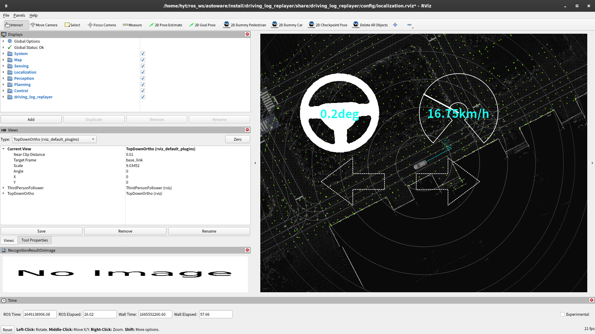

# Localization Evaluation

## Preparation

1. Copy sample scenario

   ```bash
   mkdir -p ~/driving_log_replayer_data/localization/sample
   cp -r ~/autoware/src/simulator/driving_log_replayer/docs/sample/localization/scenario.yaml ~/driving_log_replayer_data/localization/sample
   ```

2. Copy bag file from dataset

   ```bash
   cp -r ~/driving_log_replayer_data/sample_dataset/input_bag ~/driving_log_replayer_data/localization/sample
   ```

3. Filter and slice bag

   ```bash
   source ~/autoware/install/setup.bash
   cd ~/driving_log_replayer_data/localization/sample
   ros2 bag filter input_bag -o filtered_bag -x "/localization/.*" "/sensing/lidar/concatenated/pointcloud" "/tf"
   ros2 bag slice filtered_bag -o sliced_bag -s 1649138880 -e 1649138910
   rm -rf input_bag
   rm -rf filtered_bag
   mv sliced_bag input_bag
   ```

## How to run

1. Run the simulation

   ```bash
   driving_log_replayer simulation run -p localization --rate 0.5
   ```

   

2. Check the results

   Results are displayed in the terminal like below.
   The number of tests will vary slightly depending on PC performance and CPU load conditions, so slight differences are not a problem.

   ```bash
    test case 1 / 1 : use case: sample
    --------------------------------------------------
    TestResult: Passed
    Passed: Convergence: 246 / 247 -> 99.60% Reliability: NVTL Sequential NG Count: 0 (Total Test: 248)
   ```

For more information, refer to the [driving_log_replayer documentation](https://tier4.github.io/driving_log_replayer/).
