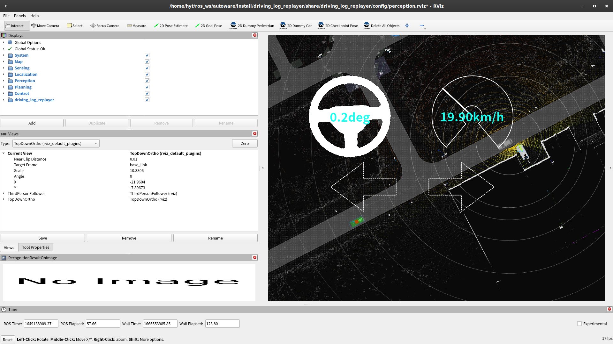

# Perception Evaluation

## Preparation

1. Copy sample scenario

   ```bash
   mkdir -p ~/driving_log_replayer_data/perception/sample
   cp -r ~/autoware/src/simulator/driving_log_replayer/docs/sample/perception/scenario.yaml ~/driving_log_replayer_data/perception/sample
   ```

2. Copy bag file from dataset

   ```bash
   mkdir -p ~/driving_log_replayer_data/perception/sample/t4_dataset
   cp -r ~/driving_log_replayer_data/sample_dataset ~/driving_log_replayer_data/perception/sample/t4_dataset
   ```

## How to run

1. Run the simulation

   ```bash
   driving_log_replayer simulation run -p perception --rate 0.5
   ```

   

2. Check the results

   Results are displayed in the terminal like below.
   The number of tests will vary slightly depending on PC performance and CPU load conditions, so slight differences are not a problem.

   ```bash
    test case 1 / 1 : use case: sample
    --------------------------------------------------
    TestResult: Passed
    Passed: 682 / 682 -> 100.00%
   ```

For more information, refer to the [driving_log_replayer documentation](https://tier4.github.io/driving_log_replayer/).
